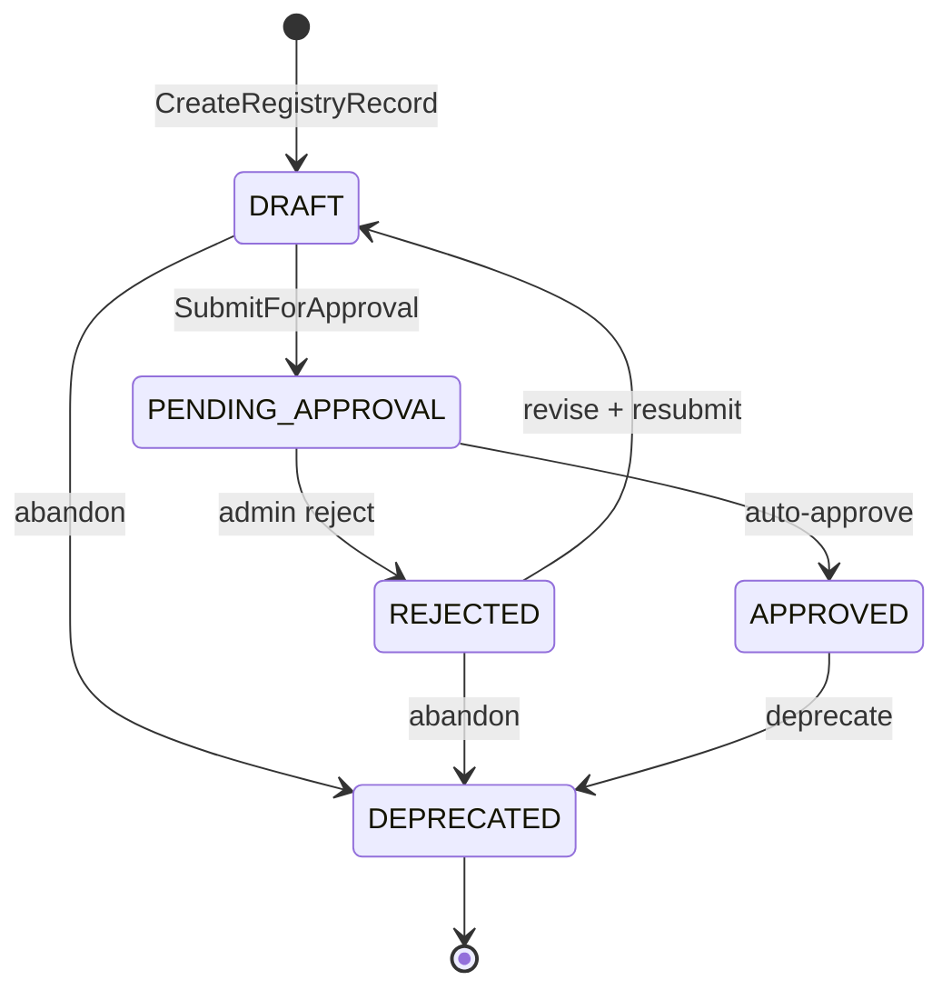

# Agent Records

A `RegistryAgentRecord` is the authoritative record for a registered agent in
the AgentCore Registry. It replaces the legacy `AgentApp` row in `AppsTable`
as the single source of truth for agent identity, lifecycle status, governance
linkage, and routing metadata. The governance framework (Decision #3) treats
every registry record as an independently-scoped governance subject: one
AuthorityUnit per record (Decision #9), one workload-identity attribute per
record (Decision #6), one design-assessment gate per record (US-ARB-017).

## Table of Contents

- [Overview](#overview)
- [Status Lifecycle](#status-lifecycle)
- [Governance Integration](#governance-integration)
- [Migration Guide — AgentApp to RegistryRecord](#migration-guide--agentapp-to-registryrecord)
- [Python Bridge — arbiter/catalog/registry_client.py](#python-bridge--arbitercatalogregistry_clientpy)
- [Roles and Permissions](#roles-and-permissions)
- [PR Roadmap](#pr-roadmap)
- [Known Deferrals](#known-deferrals)
- [References](#references)

## Overview

### What is a RegistryAgentRecord?

A `RegistryAgentRecord` is a record stored in the AWS Bedrock AgentCore
Registry, accessed via the `BedrockAgentCoreControlClient` SDK. Each record
represents one deployable agent (or tool) with:

- A stable `recordId` (12-alphanumeric string, generated by the Registry).
- A governance status (`DRAFT`, `PENDING_APPROVAL`, `APPROVED`, `REJECTED`,
  `DEPRECATED`).
- A custom descriptor (`DescriptorType.CUSTOM`) whose `inlineContent` field
  holds a JSON blob (`customDescriptorContent`) with application-specific
  metadata — including the governance `sourceProjectId` link back to the
  originating `Project`.
- Timestamps (`createdAt`, `updatedAt`) as native `Date` objects.

The authoritative TypeScript type definitions live in
`backend/src/services/registry-service.ts`:

```typescript
export interface RegistryRecord {
  recordId: string;
  name: string;
  description?: string;
  status: string;
  customDescriptorContent?: string;
  createdAt?: Date;
  updatedAt?: Date;
}

export const RegistryRecordStatusValues = {
  DRAFT: 'DRAFT',
  PENDING_APPROVAL: 'PENDING_APPROVAL',
  APPROVED: 'APPROVED',
  REJECTED: 'REJECTED',
  DEPRECATED: 'DEPRECATED',
} as const;
```

### Why the AgentCore Registry replaces AppsTable

The `AppsTable` DynamoDB table stored `AgentApp` rows keyed by `appId`. Its
shortcomings:

- It duplicated agent metadata that now lives natively in the AgentCore
  Registry service.
- Its lifecycle (`DRAFT` → `ACTIVE` → `ARCHIVED`) did not align with the
  governance model introduced for Decisions #3, #6, #7, and #9.
- Per-app governance (authority units, workload-identity attributes, case-law
  entries) was keyed on `appId`, which has no meaning outside Citadel. Moving
  the key to the Registry's native `recordId` gives every governance artefact
  a stable, service-owned identifier.

The retrofit moves every governance-relevant read and write from `AppsTable`
to the Registry, while preserving the `AgentApp` GraphQL type behind a
`@deprecated` marker during the grace period (PR 3 removes it).

### Six-PR Retrofit Plan

The governance retrofit lands across six numbered PRs. PR 0 merged
`origin/main` into `feat/ai-governance`; PRs 1–5 deliver the migration.

- **PR 0 — Merge.** `chore(merge): merge origin/main into feat/ai-governance`
  at commit `2f24f520`.
- **PR 1 — Adapters and rename.** Forward-compatible adapters
  (`agent-record-factory.ts`, `registry_client.py`), the
  `REGISTRY_TRANSITIONS` state machine, registry permissions in the role
  model, this document. Tasks T1 through T9.
- **PR 2 — CDK swap.** Replace the `AppsTable` CDK construct with an
  AgentCore Registry construct; rewire every stack reference to the
  registry ID.
- **PR 3 — TS resolvers.** Migrate `app-resolver.ts`,
  `agent-config-resolver.ts`, and `fabricator-request-resolver.ts` to
  `RegistryService`; remove the `@deprecated` `AgentApp` GraphQL type.
- **PR 4 — Python arbiter.** Rewire the fabricator, worker wrapper,
  supervisor, and seed-config Lambdas to read via `registry_client.py`.
- **PR 5 — Documentation.** Update `docs/AGENT_APPS.md` and architecture
  diagrams to remove `AppsTable`.

### Nine-Decision Record

The retrofit is anchored in nine architectural decisions (Decision #1
through Decision #9). The canonical record is stored in the memory namespace
`projects.agenticai-factory.agentcore-governance-retrofit` under keys
`retrofit-state` (PR progress) and `decision-9-authority-unit-key-rename`.
Decisions cited in this document are listed in [References](#references).

## Status Lifecycle

A `RegistryAgentRecord` moves through five states. The state machine is
defined in `backend/src/adapters/lifecycle.ts` as the `REGISTRY_TRANSITIONS`
transition map (added in PR 1-T2). Note that `REGISTRY_TRANSITIONS` is
defined but not yet wired into any resolver in PR 1 — PR 3 will route
`UpdateRegistryRecordStatus` calls through `LifecycleManager.validateTransition`.

### States

- **DRAFT** — Record has been created but has not been submitted for
  approval. Architects can edit freely. Default state after
  `CreateRegistryRecord`.
- **PENDING_APPROVAL** — Architect has submitted the record for approval via
  `SubmitRegistryRecordForApproval`. The record is immutable while in this
  state.
- **APPROVED** — The record is active and available for agent execution. The
  workload-identity gate (Decision #6) will only return fail-closed `ALLOW`
  for an `APPROVED` record.
- **REJECTED** — Approval was declined. The architect must revise and
  resubmit (transition back to `DRAFT`), or abandon (transition to
  `DEPRECATED`).
- **DEPRECATED** — Terminal state. The record is no longer available for new
  executions. Not deleted — retained for audit.

### Transition Matrix

| From               | To                   | Actor      | Side effect                                                      |
|--------------------|----------------------|------------|------------------------------------------------------------------|
| `DRAFT`            | `PENDING_APPROVAL`   | architect  | `SubmitRegistryRecordForApproval` SDK call                       |
| `DRAFT`            | `DEPRECATED`         | architect  | `UpdateRegistryRecordStatus` with `status=DEPRECATED`            |
| `PENDING_APPROVAL` | `APPROVED`           | auto / admin | Auto-approval on submit (see `updateResourceStatus` in registry-service.ts) |
| `PENDING_APPROVAL` | `REJECTED`           | admin      | `UpdateRegistryRecordStatus` with `status=REJECTED`, `statusReason` required |
| `REJECTED`         | `DRAFT`              | architect  | `UpdateRegistryRecordStatus` with `status=DRAFT` (resubmit path) |
| `REJECTED`         | `DEPRECATED`         | architect  | `UpdateRegistryRecordStatus` with `status=DEPRECATED` (abandon)  |
| `APPROVED`         | `DEPRECATED`         | architect / admin | `UpdateRegistryRecordStatus` with `status=DEPRECATED`  |
| `DEPRECATED`       | —                    | —          | Terminal; no outbound transitions                                |

Idempotent same-state transitions are permitted and produce no side effect —
`LifecycleManager.isValidTransition` returns `true` when `current === next`.

### UpdateRegistryRecordStatus call shape

```typescript
await registryService.updateResourceStatus(
  'agent',                              // ResourceType: 'agent' | 'tool'
  recordId,                             // 12-alphanumeric or legacy name
  RegistryRecordStatusValues.DEPRECATED,
  'Superseded by record r2x4abc98def',  // statusReason (audit trail)
);
```

For the `DRAFT` → `PENDING_APPROVAL` transition specifically, the service
uses `SubmitRegistryRecordForApprovalCommand` instead of
`UpdateRegistryRecordStatusCommand` because the SDK models submission as a
distinct operation. See `updateResourceStatus` in
`backend/src/services/registry-service.ts` for the branching logic.

### State Machine



## Governance Integration

The governance framework treats a `RegistryAgentRecord` as the governance
subject for every artefact that was previously keyed on `appId`. The data
model remains predominantly `Project`-keyed, however: governance artefacts
such as ADRs and ExecutionSpecifications are read by project, and the link to
a registry record flows one way, `Project → RegistryRecord`, via the
`sourceProjectId` field stored in the record's custom descriptor JSON.

### Project → RegistryRecord linkage

When an architect creates an agent from a project, the governance layer
writes `sourceProjectId` into the record's `customDescriptorContent` JSON.
The deprecated `AgentApp.sourceProjectId` column is preserved on the
`DeprecatedAgentAppShape` interface in
`backend/src/lambda/agent-record-factory.ts` so callers that still read the
legacy shape during PR 1–PR 3 receive the same value.

Lookup path, in order of precedence:

1. Read the record via `RegistryService.getResource`.
2. Parse `record.customDescriptorContent` as JSON.
3. Return `parsed.sourceProjectId` if it is a string.

The reference implementation is `projectIdFromRegistryRecord` in
`backend/src/lambda/agent-record-factory.ts`:

```typescript
export function projectIdFromRegistryRecord(
  record: RegistryRecord,
): string | undefined;
```

Malformed JSON is swallowed and treated as "no link".

### Fabricator design-assessment gate (US-ARB-017)

The design-assessment gate (US-ARB-017) enforces that an agent cannot be
fabricated unless its source project has a completed `AgentDesignAssessment`.
The gate resolves the `sourceProjectId` from the registry record (via
`projectIdFromRegistryRecord` in TypeScript, `get_source_project_id` in
Python), then reads `AgentDesignAssessmentsTable` by `projectId`. In PR 1 the
gate still reads from `AppsTable.sourceProjectId` — PR 4 swaps it to the
registry path.

### Per-registryId authority units (US-ARB-014, Decision #9)

Decision #9 renames `AuthorityUnit.appId` to `AuthorityUnit.registryId`. One
`AuthorityUnit` row exists per registry record. The row controls the scoped
authority `fabricator-<registryId>-create-agents`, granted on registry
record creation (US-ARB-014) and revoked on registry record deletion.

PR 1 renames the model field and the loader signature
(`load_governance_state(registry_id=None)`) plus the seed data
(`AuthorityUnit.registryId='*GLOBAL*'` for US-ARB-011). PR 3 migrates the
resolver write path from `createApp`/`deleteApp` hooks to the registry
create/delete resolvers. PR 4 migrates the Python activator and the
`case_law_admin` CLI (US-ARB-013).

### Workload-identity gate (Decision #6, engine position 3)

The governance engine evaluates gates in order. Position 3 is the
workload-identity gate: it checks that the agent invoking a tool holds a
workload-identity attribute matching the target record's `registryId`. In
strict-mode deployments this gate fails closed — a missing or mismatched
identity denies the invocation with no fallback. In permissive or shadow
mode the gate logs but does not deny.

The gate's `registryId` attribute is sourced from the workload identity
token, not from `customDescriptorContent`. Decision #9 mandates the
attribute name is `registryId` (not `appId`), matching the authority-unit
key rename.

### ADR / ExecutionSpecification / InterrogationRound remain Project-keyed

Three governance tables do **not** move to a registry key:

- `ADRTable` (see `backend/src/lambda/adr-resolver.ts`)
- `ExecutionSpecificationsTable` (see `backend/src/lambda/execspec-resolver.ts`)
- `InterrogationRoundsTable` (see `backend/src/lambda/interrogation-round-resolver.ts`)

These artefacts belong to a `Project`, not an individual agent. The link to
a registry record, when needed, flows `Project → RegistryRecord` via
`sourceProjectId`. There is no `RegistryRecord → ADR` back-reference and the
retrofit does not introduce one.

This boundary matters for any resolver that reads governance evidence for a
registry record: it must first resolve `sourceProjectId`, then query the
project-keyed table. See the `projectIdFromRegistryRecord` / `get_source_project_id`
helpers in both language bindings.

### Registry vs AppsTable — Complementary model

The retrofit retires `AgentApp`-as-agent-catalog, not `AppsTable` itself.
`AppsTable` continues to store *per-app agent bindings* — the set of agents
a given application uses and any per-binding customization applied to each.
The AgentCore Registry owns the authoritative catalogue of deployable
agents; `AppsTable` owns the app-to-agent wiring. The two stores are
complementary, not substitutes.

**What each table owns:**

- **AgentCore Registry** — authoritative catalogue of deployable agents and
  tools. One `RegistryAgentRecord` per agent (see
  `backend/src/services/registry-service.ts`). Defines identity, lifecycle
  status, governance linkage, and the custom descriptor.
- **AppsTable** — per-app agent bindings. One row per (app, agent) pair,
  carrying per-binding overrides such as `systemPromptAddition` and
  `modelOverride`. Not an agent definition; a reference to an agent with
  app-local tweaks.

**DynamoDB row shape for a binding.** For an app `app-42` with two bound
agents `r1a2bc34def5` and `r9z8yx76wvut`, each with a custom
`systemPromptAddition`, `AppsTable` carries two rows:

```text
groupId='APP#app-42', sortId='AGENT#r1a2bc34def5',
  systemPromptAddition='You speak as the onboarding guide.',
  modelOverride='anthropic.claude-3-5-sonnet-20241022-v2:0',
  status='READY'

groupId='APP#app-42', sortId='AGENT#r9z8yx76wvut',
  systemPromptAddition='Prefer terse responses; no markdown tables.',
  modelOverride=None,
  status='READY'
```

The registry-side records for the same two agents carry only agent-level
metadata, unaffected by how `app-42` uses them:

```text
recordId='r1a2bc34def5', name='onboarding-guide', status='APPROVED',
  customDescriptorContent='{"sourceProjectId":"proj-onb","manifest":{...}}'

recordId='r9z8yx76wvut', name='summariser', status='APPROVED',
  customDescriptorContent='{"sourceProjectId":"proj-sum","manifest":{...}}'
```

**Read path — `load_app_scoped_agents(app_id)`.**
`arbiter/supervisor/agent_config.py` resolves app-scoped agents across the
two tables in sequence:

1. Query `AppsTable` by `groupId='APP#{app_id}'` to list the bound agent
   IDs and per-binding overrides.
2. For each binding, `get_item` into `agentConfigTable` by the bound agent
   ID for the base agent configuration.
3. Merge the binding overrides (`systemPromptAddition`, `modelOverride`)
   onto the base config before returning.

This path stays unchanged through the retrofit. PR 4 does not migrate
`load_app_scoped_agents` to `arbiter/catalog/registry_client.py` — the
registry carries no binding metadata, so a registry read alone cannot
service the call.

**Why bindings do not belong on registry records.** Binding metadata is
per-(app, agent), not per-agent. `customDescriptorContent` on a
`RegistryAgentRecord` describes the agent itself — its manifest, its
`sourceProjectId`, its capabilities. There is no natural place to attach
per-binding customization to a record without inventing app-keyed fields
inside the descriptor JSON (for example, `bindings[appId].systemPromptAddition`),
which couples the agent record to the set of apps that consume it and
breaks the "record describes the agent" invariant.

**Future direction.** A later architectural decision may consolidate
bindings into registry metadata — for example, via a dedicated
`AppAgentBindings` table in the registry surface, registry-side custom
fields scoped by app, or GraphQL field-level overrides on the agent query.
Any of these requires a binding-model architecture decision outside the
scope of the AgentCore Registry governance retrofit. This document tracks
the retrofit only; see [Known Deferrals](#known-deferrals) for the deferred
migration.

## Migration Guide — AgentApp to RegistryRecord

The `AgentApp` shape is deprecated (Decision #5) but remains readable during
the grace period through the adapter module
`backend/src/lambda/agent-record-factory.ts` (added in PR 1-T5). Use this
module to incrementally migrate call sites off `AppsTable` without a
single-PR rewrite.

### Field Mapping

| AgentApp field           | RegistryRecord equivalent                                 |
|--------------------------|-----------------------------------------------------------|
| `appId`                  | `recordId`                                                |
| `name`                   | `name`                                                    |
| `description`            | `description`                                             |
| `status` (enum `AppStatus`) | `status` (`RegistryRecordStatusValues`)                |
| `version`                | `version` (reserved; not written by the factory in PR 1) |
| `createdAt` / `updatedAt` (ISO strings) | `createdAt` / `updatedAt` (`Date` objects) |
| `orgId`                  | `customDescriptorContent.appId` (string FK in the metadata JSON) |
| `routingConfig`          | `customDescriptorContent.manifest` (JSON object, typed as `AgentCustomMetadata.manifest`) |
| `sourceProjectId`        | `customDescriptorContent.sourceProjectId`                 |

Two notes on the mapping:

- `orgId` is carried inside the descriptor JSON as a field named `appId`
  because the descriptor shape predates the rename. The factory preserves
  this legacy key name.
- `createdAt` and `updatedAt` change type: `AgentApp` stored ISO 8601 strings
  on DynamoDB, `RegistryRecord` receives SDK-native `Date` objects. The
  factory converts between the two. Malformed date strings are dropped
  silently (see `registryRecordFromAgentApp`).

### The agent-record-factory.ts adapter

The factory exposes three pure functions. None of them read or write to the
Registry — they are in-memory projections. Callers combine them with
`RegistryService` calls as needed.

#### agentAppFromRegistryRecord

```typescript
export function agentAppFromRegistryRecord(
  record: RegistryRecord,
): Partial<DeprecatedAgentAppShape>;
```

Projects a registry record into the fields downstream code previously read
from `AgentApp`. Returns `Partial` because not every legacy field is
recoverable (for example, `version` is not carried in the custom descriptor
in PR 1). Malformed `customDescriptorContent` JSON is swallowed — the
function returns whatever has been populated rather than throwing.

```typescript
import { agentAppFromRegistryRecord } from './agent-record-factory';
import { RegistryService } from '../services/registry-service';

const service = new RegistryService({ registryId, region });
const record = await service.getResource('agent', agentId);
if (record) {
  const legacyView = agentAppFromRegistryRecord(record);
  return legacyView.sourceProjectId;
}
```

#### registryRecordFromAgentApp

```typescript
export function registryRecordFromAgentApp(
  app: DeprecatedAgentAppShape,
): Partial<RegistryRecord>;
```

Builds a registry record skeleton from an `AgentApp`. Used by PR 3 when
migrating existing `AppsTable` rows into the registry. The function embeds
`appId` and `sourceProjectId` into `customDescriptorContent` via the
`AgentCustomMetadata` shape (extended with `sourceProjectId` since the base
interface in `backend/src/services/registry-service.ts` does not declare it).

```typescript
import { registryRecordFromAgentApp } from './agent-record-factory';

const legacyApp = await getLegacyAgentApp(appId);
const seed = registryRecordFromAgentApp(legacyApp);
await service.createResource('agent', seed.recordId!, {
  name: seed.name!,
  description: seed.description,
  customMetadata: seed.customDescriptorContent!,
});
```

#### projectIdFromRegistryRecord

```typescript
export function projectIdFromRegistryRecord(
  record: RegistryRecord,
): string | undefined;
```

Extracts the governance `sourceProjectId` from a record's
`customDescriptorContent`. Used by the fabricator design-assessment gate to
resolve the originating project. Returns `undefined` when the descriptor is
absent, malformed, or lacks a `sourceProjectId` field.

```typescript
import { projectIdFromRegistryRecord } from './agent-record-factory';

const record = await service.getResource('agent', agentId);
const projectId = record ? projectIdFromRegistryRecord(record) : undefined;
if (!projectId) {
  return { ok: false, reason: 'no_source_project' };
}
const assessment = await getAgentDesignAssessment(projectId);
```

## Python Bridge — `arbiter/catalog/registry_client.py`

The arbiter layer (Python 3.14) reads registry records via
`arbiter/catalog/registry_client.py`. This module is read-only in PR 1 —
writes still land against `AppsTable` — and ships three public functions
with a strict graceful-degrade contract.

### Contract

All functions return `None` (or `[]` for list operations) on any AWS failure.
They never raise. Callers rely on this to fall back to legacy reads during
the migration window, matching the forward-compatible pattern already used
in `arbiter/fabricator/design_assessment_gate.py`.

The boto3 client is constructed lazily (QB-013-1). The first call pays the
client-construction cost; subsequent calls reuse the cached client. A
test-only hook `__reset_client_for_test()` forces a rebuild.

### Public Functions

#### get_agent_record

```python
def get_agent_record(registry_id: str, record_id: str) -> dict | None:
    """Return the RegistryRecord as a dict, or None on any failure."""
```

Wraps `GetRegistryRecord`. Returns a dict with keys `recordId`, `name`,
`description`, `status`, `customDescriptorContent` (JSON string, may be
`None`), `createdAt`, `updatedAt`. Logs a warning on `ClientError` and
returns `None`.

#### get_source_project_id

```python
def get_source_project_id(registry_id: str, record_id: str) -> str | None:
    """Return the governance sourceProjectId for a registry record, or None."""
```

Calls `get_agent_record`, parses `customDescriptorContent` as JSON, and
returns the `sourceProjectId` field if it is a string. Symmetric to the
TypeScript `projectIdFromRegistryRecord` helper — both read the same JSON
written by `registryRecordFromAgentApp`.

#### list_agent_records

```python
def list_agent_records(
    registry_id: str,
    filter_status: str | None = None,
) -> list[dict]:
    """Return a list of registry record dicts, filtered by status when given."""
```

Wraps `ListRegistryRecords` and paginates to completion. Each item in the
returned list has `recordId`, `name`, `status`, and `updatedAt` only —
summary records do not include `customDescriptorContent`. Callers needing
custom metadata must follow up with `get_agent_record`.

### PR 4 usage example — fabricator design-assessment gate

In PR 4, `arbiter/fabricator/design_assessment_gate.py` will call
`get_source_project_id` in place of its current `AppsTable.get_item` path.
The gate logic is:

```python
from arbiter.catalog.registry_client import get_source_project_id

def check_design_assessment_gate(
    registry_id: str,
    record_id: str,
) -> tuple[bool, str]:
    project_id = get_source_project_id(registry_id, record_id)
    if project_id is None:
        # Graceful degrade: missing record or no sourceProjectId means the
        # gate cannot verify. In strict mode this fails closed at a higher
        # layer; in permissive mode it logs and allows.
        return (False, "source_project_unresolved")

    assessment = fetch_agent_design_assessment(project_id)
    if assessment is None or assessment.get("status") != "COMPLETED":
        return (False, "design_assessment_incomplete")

    return (True, "ok")
```

The gate never raises on registry read failure — it receives `None` and
returns a structured deny result.

## Roles and Permissions

Decision #7 defines the role → registry permission matrix. The
implementation lives in `backend/src/utils/auth.ts` (PR 1-T3). The admin
role short-circuits: `hasPermission` returns `true` for any permission when
the caller holds role `admin`. For non-admin roles the matrix is:

| Role              | `registry:create` | `registry:update` | `registry:submit` | `registry:approve` | `registry:delete` | `registry:read` |
|-------------------|-------------------|-------------------|-------------------|---------------------|--------------------|-----------------|
| `admin`           | yes (wildcard)    | yes (wildcard)    | yes (wildcard)    | yes (wildcard)      | yes (wildcard)     | yes (wildcard)  |
| `architect`       | yes               | yes               | yes               | no                  | no                 | no              |
| `developer`       | no                | no                | no                | no                  | no                 | yes             |
| `project_manager` | no                | no                | no                | no                  | no                 | no              |

Two notes on how `auth.ts` implements this:

- `admin` permissions are granted by a role short-circuit at the top of
  `hasPermission` rather than by an explicit entry in `rolePermissions`.
  Any permission string — including `registry:approve` and `registry:delete` —
  is therefore allowed for an admin caller.
- The `architect` entry in `rolePermissions` lists `registry:create`,
  `registry:update`, and `registry:submit`. The `developer` entry lists
  `registry:read`. The `project_manager` entry contains no `registry:*`
  permissions. These are the only registry permission strings wired into
  `rolePermissions` in PR 1-T3.
- `registry:approve` and `registry:delete` are covered by the admin
  wildcard only. PR 3 may introduce a dedicated approver role — that
  extension is out of scope for PR 1.

## PR Roadmap

### PR 0 — Merge

- Commit `2f24f520` (`chore(merge): merge origin/main into feat/ai-governance`).
- First-parent `66eed38e`, second-parent `d8e6a46a`, 41 files changed.
- Verified with `tsc --noEmit` exit 0 and a clean working tree.
- Scope: merge only. No resolver, schema, or CDK changes.

### PR 1 — Adapters and rename

PR 1 lands on branch `retrofit/pr-1-adapters-and-rename`. It introduces the
forward-compatible adapters that PRs 2–4 call into. Task breakdown:

- T1 — Branch and scaffolding for the PR series.
- T2 — `REGISTRY_TRANSITIONS` added to `backend/src/adapters/lifecycle.ts`
  (not yet wired into any resolver).
- T3 — `registry:*` permissions in `backend/src/utils/auth.ts`: architect
  receives create/update/submit; developer receives read.
- T4 — `AuthorityUnit.appId` → `AuthorityUnit.registryId` rename
  (Decision #9) in the Python arbiter model and seed data.
- T5 — `backend/src/lambda/agent-record-factory.ts` adapter.
- T6 — `arbiter/catalog/registry_client.py` read-only Python bridge.
- T7 — `docs/AGENT_RECORDS.md` (this document).
- T8 — Unit tests for the adapters under `backend/src/adapters/__tests__/`
  and `arbiter/catalog/__tests__/`.
- T9 — PR description, backlog reconciliation, session plan note update.

PR 1 scope excludes: CDK changes, resolver rewires, Python arbiter runtime
rewires, and `AgentApp` GraphQL type removal.

### PR 2 — CDK swap

Replace the `AppsTable` CDK construct with an AgentCore Registry construct
and rewire every stack reference to the registry ID. Branch
`retrofit/pr-2-cdk-swap`. No resolver or arbiter code changes. Details in
the saved session plan note (memory key `retrofit-state`).

### PR 3 — TypeScript resolvers

Migrate `app-resolver.ts`, `agent-config-resolver.ts`, and
`fabricator-request-resolver.ts` to `RegistryService`; wire
`REGISTRY_TRANSITIONS` into `LifecycleManager.validateTransition` ahead of
`UpdateRegistryRecordStatus`; remove the `@deprecated` `AgentApp` GraphQL
type. Branch `retrofit/pr-3-ts-resolvers`.

### PR 4 — Python arbiter scoped migration

PR 4 scopes to what the governance retrofit actually requires on the
arbiter side: it adds a `get_source_project_id` fallback in the fabricator
design-assessment gate, sanity-checks the arbiter Python files that PR 0
brought in via git auto-merge, and documents the complementary
registry + `AppsTable` model (this section). The `load_app_scoped_agents`
migration to `arbiter/catalog/registry_client.py` is deferred — the
registry does not carry per-binding overrides, so that migration requires
a binding-model architecture decision out of scope here. See
[Known Deferrals](#known-deferrals) for the full rationale. Branch
`retrofit/pr-4-python-arbiter`.

### PR 5 — Documentation

Update `docs/AGENT_APPS.md` and `docs/ARCHITECTURE.md` to remove `AppsTable`
references. Branch `retrofit/pr-5-docs`.

## Known Deferrals

These follow-ups surfaced in the Path A audit but PR 1 does not resolve them:

- **Auto-merge sanity check in the Python arbiter.** PR 0 brought
  `arbiter/fabricator/tools_config.py`, `arbiter/workerWrapper/index.py`,
  `arbiter/workerWrapper/agent_runner.py`, `arbiter/supervisor/index.py`,
  and `arbiter/seedConfig/index.py` up to date via git auto-merge. PR 1 does
  not re-verify semantic correctness of those auto-merged regions; PR 4
  owns that review when it rewires the same files to the registry path.
- **`AgentCustomMetadata.appId` field rename.** The descriptor JSON still
  exposes a field named `appId` (see `AgentCustomMetadata` in
  `backend/src/services/registry-service.ts`). Decision #9 renames the
  authority-unit key to `registryId` but leaves the descriptor-level field
  name alone. A follow-up decision may align the two; it is intentionally
  separate from Decision #9.
- **`REGISTRY_ENABLED` feature flag interpretation.** The flag gates whether
  the registry code paths run in the catalog resolvers
  (`agent-config-resolver.ts`, `tool-config-resolver.ts`). It is not a
  governance-owned flag — the governance code paths do not check it. No
  action is required from the retrofit; the flag's owner is the catalog
  team.
- **`AgentApp` GraphQL type removal.** The type is marked `@deprecated` in
  PR 1 but remains in the schema for the grace period. PR 3 removes it
  after resolver migration completes. Any frontend code still reading the
  type must migrate before PR 3 lands.
- **`load_app_scoped_agents` migration to `catalog.registry_client`
  deferred.** A binding-model architecture decision is required before
  this call can move off `AppsTable`. `AppsTable` remains the source of
  truth for app-agent bindings and per-binding customization
  (`systemPromptAddition`, `modelOverride`). See
  [Registry vs AppsTable — Complementary model](#registry-vs-appstable--complementary-model)
  for the rationale.

## References

### Files cited

- `backend/src/services/registry-service.ts` — type definitions and
  `RegistryService` class.
- `backend/src/adapters/lifecycle.ts` — `REGISTRY_TRANSITIONS` (PR 1-T2).
- `backend/src/lambda/agent-record-factory.ts` — `AgentApp` ⇄
  `RegistryRecord` adapter (PR 1-T5).
- `backend/src/utils/auth.ts` — role → permission matrix (PR 1-T3).
- `arbiter/catalog/registry_client.py` — Python read-only bridge (PR 1-T6).
- `arbiter/fabricator/design_assessment_gate.py` — PR 4 consumer of the
  Python bridge.
- PR 3 resolver migration targets: `backend/src/lambda/app-resolver.ts`,
  `agent-config-resolver.ts`, `fabricator-request-resolver.ts`.
- PR 4 arbiter rewire targets: `arbiter/fabricator/tools_config.py`,
  `arbiter/workerWrapper/index.py`, `arbiter/workerWrapper/agent_runner.py`,
  `arbiter/supervisor/index.py`, `arbiter/seedConfig/index.py`.

### Decision and user-story identifiers

- Decision #3 — Registry status domain and allowed transitions.
- Decision #5 — `AgentApp` deprecation timeline.
- Decision #6 — Workload-identity gate at engine position 3, fail-closed in
  strict mode.
- Decision #7 — Role → registry permission matrix.
- Decision #9 — `AuthorityUnit.appId` → `AuthorityUnit.registryId` rename.
- US-ARB-001 — `AuthorityUnit` dataclass.
- US-ARB-002 — `AuthorityUnitsTable` schema.
- US-ARB-003 — Hierarchy loader signature.
- US-ARB-011 — `AuthorityUnit` seed data.
- US-ARB-013 — Case-law CLI.
- US-ARB-014 — Per-registry fabricator authority lifecycle.
- US-ARB-017 — Fabricator design-assessment gate.
- QB-013-1 — Lazy boto3 client pattern.

### Memory references

- `projects.agenticai-factory.agentcore-governance-retrofit` —
  `retrofit-state` (PR progress) and
  `decision-9-authority-unit-key-rename` (decision record).
