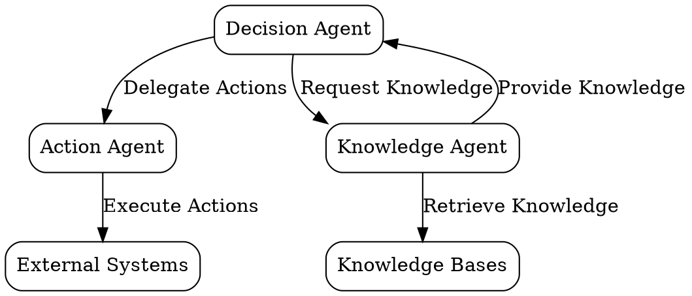
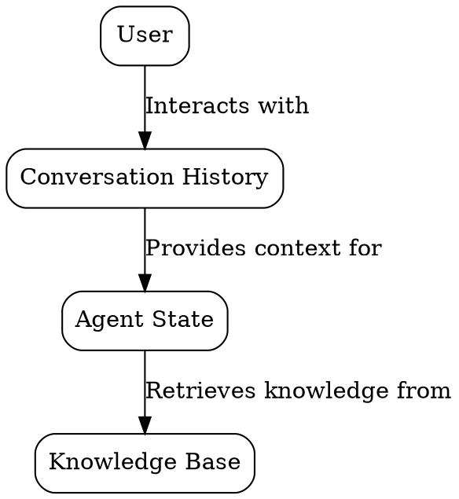
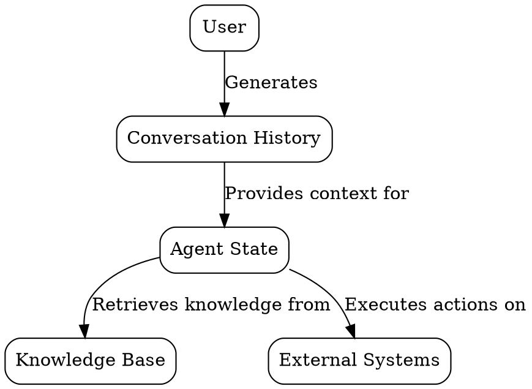
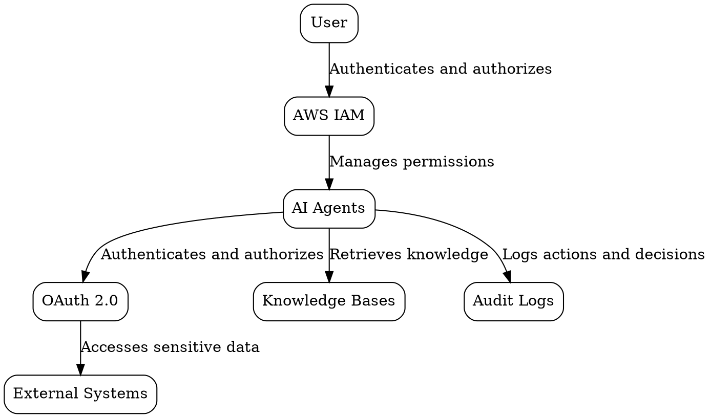
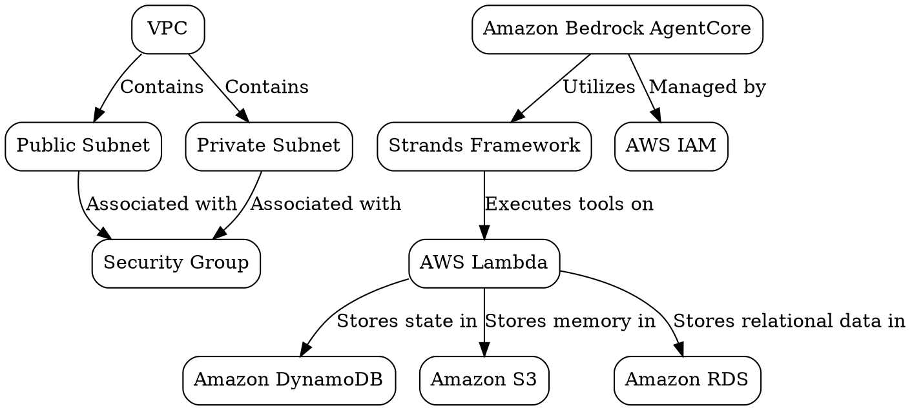
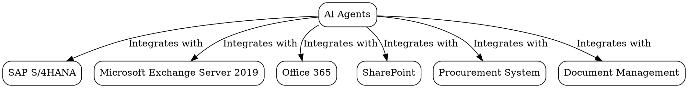
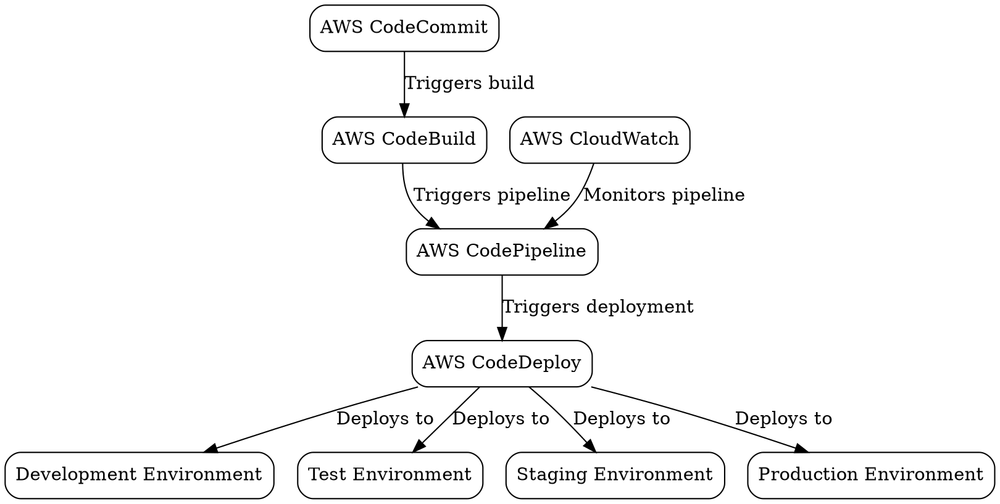
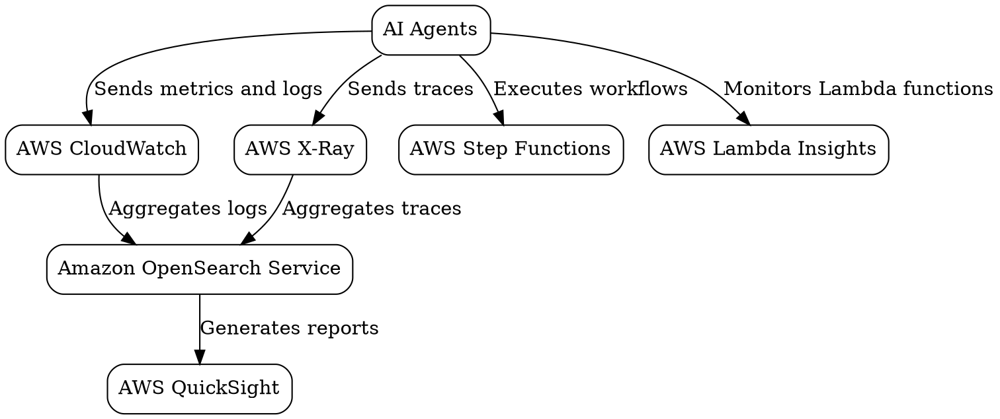

# Detailed Technical Design - Demo13

**Version:** 1.0

---

## 1. Agent Architecture Overview

### 1.1 Agent Breakdown
The Citadel consists of several AI agents, each with specific roles and responsibilities. The primary agents include:

- **Decision Agent:** Responsible for detecting exceptions, making decisions on how to resolve them, and escalating complex cases to human agents.
- **Action Agent:** Responsible for executing actions based on decisions made by the Decision Agent, such as sending emails to suppliers, updating invoice records, or triggering approval workflows.
- **Knowledge Agent:** Responsible for managing and retrieving knowledge from knowledge bases to support decision-making and action execution.

### 1.2 Orchestration Patterns
The Citadel utilizes several orchestration patterns to coordinate the activities of the AI agents:

- **Agents-as-Tools:** Agents can act as tools for other agents, enabling hierarchical delegation and dynamic consultation.
- **Swarms:** Agents can collaborate autonomously in a self-organizing manner, deciding when to hand off tasks to each other.
- **Graphs:** Agents can follow predefined workflows with conditional routing and decision points.
- **Meta Agents:** Single agents equipped with tools that let them think about thinking, dynamically creating other agents and orchestrating complex workflows.

### 1.3 Foundation Models
The Citadel utilizes foundation models from Amazon Bedrock to provide the reasoning capabilities for the AI agents. The primary foundation models include:

- **Amazon Nova:** A high-throughput, consistent structured output, and ultra-low cost foundation model suitable for multi-agent architectures.
- **Amazon Bedrock AgentCore:** A fully managed service that enables organizations to build and configure autonomous agents in their applications without requiring infrastructure management or custom code writing.

### 1.4 Technology Stack
The technology stack for the Citadel includes:

- **Amazon Bedrock AgentCore:** For hosting and managing AI agents.
- **Strands Framework:** For building and orchestrating AI agents.
- **AWS Lambda:** For executing agent tools and actions.
- **Amazon DynamoDB:** For storing agent state and context.
- **Amazon S3:** For storing agent memory and knowledge bases.
- **AWS IAM:** For managing agent permissions and cross-agent communication.

### 1.5 Component Responsibilities and Interactions
The components of the Citadel interact as follows:

- **Decision Agent** -> **Knowledge Agent:** Requests knowledge to support decision-making.
- **Decision Agent** -> **Action Agent:** Delegates actions to be executed.
- **Action Agent** -> **External Systems:** Executes actions and interacts with external systems.
- **Knowledge Agent** -> **Decision Agent:** Provides knowledge to support decision-making.

### 1.6 Architectural Patterns and Principles Applied
The Citadel applies the following architectural patterns and principles:

- **Model-Driven Approach:** Utilizes the capabilities of state-of-the-art models for planning, chaining thoughts, calling tools, and reflecting.
- **Agentic Loop System:** Manages context, memory, and decision-making for autonomous, goal-driven behavior.
- **Composable and Scalable Architecture:** Designed to be gradually adopted and freely combined, allowing developers to start with single agents, add specialists as tools, evolve to swarms, and orchestrate with graphs as their needs grow.

### 1.7 Scalability and Performance Considerations
The Citadel is designed with scalability and performance in mind:

- **Auto Scaling:** Implements auto-scaling capabilities to handle the expected growth in invoice volume and peak loads.
- **Performance Optimization:** Continuously monitors and optimizes the performance of AI agents, ensuring they meet the required response times and throughput.
- **High Availability:** Designs the solution with high availability in mind, ensuring minimal downtime and quick recovery in case of disruptions.
- **Disaster Recovery:** Establishes a disaster recovery plan to ensure data integrity and system availability in case of catastrophic events.

---

## 2. Agent Component Design

### 2.1 Decision Agent
The Decision Agent is responsible for detecting exceptions, making decisions on how to resolve them, and escalating complex cases to human agents. The Decision Agent utilizes the following components:

- **Foundation Model:** Amazon Nova for reasoning and decision-making.
- **Tools:** Python functions for interacting with external systems and knowledge bases.
- **Actions:** Specific actions to be taken based on decisions, such as sending emails to suppliers or updating invoice records.
- **Decision Logic:** Workflows and prompt engineering to guide the agent's decision-making process.

### 2.2 Action Agent
The Action Agent is responsible for executing actions based on decisions made by the Decision Agent. The Action Agent utilizes the following components:

- **Foundation Model:** Amazon Bedrock AgentCore for executing actions.
- **Tools:** Python functions for interacting with external systems.
- **Actions:** Specific actions to be executed, such as sending emails to suppliers or updating invoice records.
- **Decision Logic:** Workflows and prompt engineering to guide the agent's action execution process.

### 2.3 Knowledge Agent
The Knowledge Agent is responsible for managing and retrieving knowledge from knowledge bases to support decision-making and action execution. The Knowledge Agent utilizes the following components:

- **Foundation Model:** Amazon Bedrock AgentCore for managing knowledge.
- **Tools:** Python functions for interacting with knowledge bases.
- **Actions:** Specific actions to be taken based on knowledge retrieval, such as providing context for decision-making or augmenting agent performance.
- **Decision Logic:** Workflows and prompt engineering to guide the agent's knowledge management process.

### 2.4 Component Diagram
The following DOT diagram illustrates the detailed breakdown of the Citadel components:



### 2.5 Component Responsibilities and Interfaces
The responsibilities and interfaces of each component are as follows:

- **Decision Agent:**
  - **Responsibilities:** Detect exceptions, make decisions on how to resolve them, and escalate complex cases to human agents.
  - **Interfaces:** Interacts with the Knowledge Agent to request knowledge and with the Action Agent to delegate actions.

- **Action Agent:**
  - **Responsibilities:** Execute actions based on decisions made by the Decision Agent.
  - **Interfaces:** Interacts with External Systems to execute actions.

- **Knowledge Agent:**
  - **Responsibilities:** Manage and retrieve knowledge from knowledge bases to support decision-making and action execution.
  - **Interfaces:** Interacts with the Decision Agent to provide knowledge and with Knowledge Bases to retrieve knowledge.

### 2.6 Inter-Component Communication Patterns
The inter-component communication patterns are as follows:

- **Decision Agent -> Action Agent:** Delegate actions to be executed.
- **Decision Agent -> Knowledge Agent:** Request knowledge to support decision-making.
- **Action Agent -> External Systems:** Execute actions and interact with external systems.
- **Knowledge Agent -> Decision Agent:** Provide knowledge to support decision-making.

### 2.7 Component Dependencies and Initialization Order
The component dependencies and initialization order are as follows:

- **Decision Agent:** Depends on the Knowledge Agent for knowledge retrieval.
- **Action Agent:** Depends on the Decision Agent for action delegation.
- **Knowledge Agent:** Depends on Knowledge Bases for knowledge retrieval.
- **Initialization Order:** Knowledge Bases -> Knowledge Agent -> Decision Agent -> Action Agent

### 2.8 Error Handling and Resilience Patterns
The error handling and resilience patterns are as follows:

- **Error Handling:** Implements robust error handling mechanisms to handle exceptions and failures.
- **Resilience Patterns:** Utilizes auto-scaling, performance optimization, high availability, and disaster recovery to ensure resilience and availability.

---

## 3. Agent State and Memory

### 3.1 Agent Memory Schemas
The Citadel utilizes the following agent memory schemas for context management:

- **Conversation History:** Stores the history of user interactions with the AI agents to provide context for decision-making and action execution.
- **Agent State:** Stores the current state of each agent, including its role, responsibilities, and any relevant data.
- **Knowledge Base:** Stores the knowledge used by the Knowledge Agent to support decision-making and action execution.

### 3.2 Context Management Strategies
The Citadel applies the following context management strategies:

- **Session Management:** Manages the state of user sessions with the AI agents, ensuring continuity and evolving context.
- **Tool Specifications:** Defines capability boundaries and usage guidance for agent tools.
- **System Prompts:** Establishes the agent's role and goals, guiding its behavior and decision-making.

### 3.3 State Persistence Mechanisms
The Citadel utilizes the following state persistence mechanisms:

- **Amazon DynamoDB:** For storing agent state and context.
- **Amazon S3:** For storing agent memory and knowledge bases.
- **Durable Session Management:** Ensures automatic persistence and restoration of agent conversations and state.

### 3.4 Entity-Relationship Diagram
The following DOT diagram illustrates the entity-relationship diagram for the Citadel:



### 3.5 Database Schema Definitions
The database schema definitions for the Citadel are as follows:

- **Conversation History Table:**
  - **Fields:** user_id, conversation_id, message, timestamp
  - **Indexes:** user_id, conversation_id
  - **Constraints:** user_id and conversation_id must be unique

- **Agent State Table:**
  - **Fields:** agent_id, state, timestamp
  - **Indexes:** agent_id
  - **Constraints:** agent_id must be unique

- **Knowledge Base Table:**
  - **Fields:** knowledge_id, knowledge, timestamp
  - **Indexes:** knowledge_id
  - **Constraints:** knowledge_id must be unique

### 3.6 Data Flow Diagram
The following DOT diagram illustrates the data flow diagram for the Citadel:



### 3.7 Data Retention and Archival Strategy
The data retention and archival strategy for the Citadel is as follows:

- **Conversation History:** Retained for 7 years to ensure traceability and accountability.
- **Agent State:** Retained for the duration of the user session to ensure continuity and evolving context.
- **Knowledge Base:** Retained indefinitely to ensure the availability of knowledge for decision-making and action execution.

### 3.8 Data Migration Approach
The data migration approach for the Citadel is as follows:

- **Initial Migration:** Migrate existing data from external systems to the Citadel's data stores.
- **Ongoing Migration:** Continuously migrate new data from external systems to the Citadel's data stores as it is generated.

---

## 4. Agent Tool APIs

### 4.1 Tool Definitions
The Citadel utilizes the following agent tools and their schemas:

- **SendEmailTool:** Sends an email to a supplier.
  - **Schema:**
    ```json
    {
      "name": "sendEmail",
      "description": "Sends an email to a supplier.",
      "parameters": {
        "type": "object",
        "properties": {
          "to": {
            "type": "string",
            "description": "The email address of the supplier."
          },
          "subject": {
            "type": "string",
            "description": "The subject of the email."
          },
          "body": {
            "type": "string",
            "description": "The body of the email."
          }
        }
      }
    }
    ```

- **UpdateInvoiceTool:** Updates an invoice record.
  - **Schema:**
    ```json
    {
      "name": "updateInvoice",
      "description": "Updates an invoice record.",
      "parameters": {
        "type": "object",
        "properties": {
          "invoice_id": {
            "type": "string",
            "description": "The ID of the invoice to be updated."
          },
          "field": {
            "type": "string",
            "description": "The field to be updated."
          },
          "value": {
            "type": "string",
            "description": "The new value for the field."
          }
        }
      }
    }
    ```

- **TriggerApprovalWorkflowTool:** Triggers an approval workflow.
  - **Schema:**
    ```json
    {
      "name": "triggerApprovalWorkflow",
      "description": "Triggers an approval workflow.",
      "parameters": {
        "type": "object",
        "properties": {
          "workflow_id": {
            "type": "string",
            "description": "The ID of the approval workflow to be triggered."
          }
        }
      }
    }
    ```

### 4.2 Action Schemas
The Citadel utilizes the following action schemas for agent-to-agent communication:

- **SendEmailAction:** Sends an email to a supplier.
  - **Schema:**
    ```json
    {
      "name": "sendEmail",
      "description": "Sends an email to a supplier.",
      "input": {
        "type": "object",
        "properties": {
          "to": {
            "type": "string",
            "description": "The email address of the supplier."
          },
          "subject": {
            "type": "string",
            "description": "The subject of the email."
          },
          "body": {
            "type": "string",
            "description": "The body of the email."
          }
        }
      },
      "output": {
        "type": "object",
        "properties": {
          "status": {
            "type": "string",
            "description": "The status of the email sending action."
          }
        }
      }
    }
    ```

- **UpdateInvoiceAction:** Updates an invoice record.
  - **Schema:**
    ```json
    {
      "name": "updateInvoice",
      "description": "Updates an invoice record.",
      "input": {
        "type": "object",
        "properties": {
          "invoice_id": {
            "type": "string",
            "description": "The ID of the invoice to be updated."
          },
          "field": {
            "type": "string",
            "description": "The field to be updated."
          },
          "value": {
            "type": "string",
            "description": "The new value for the field."
          }
        }
      },
      "output": {
        "type": "object",
        "properties": {
          "status": {
            "type": "string",
            "description": "The status of the invoice update action."
          }
        }
      }
    }
    ```

- **TriggerApprovalWorkflowAction:** Triggers an approval workflow.
  - **Schema:**
    ```json
    {
      "name": "triggerApprovalWorkflow",
      "description": "Triggers an approval workflow.",
      "input": {
        "type": "object",
        "properties": {
          "workflow_id": {
            "type": "string",
            "description": "The ID of the approval workflow to be triggered."
          }
        }
      },
      "output": {
        "type": "object",
        "properties": {
          "status": {
            "type": "string",
            "description": "The status of the approval workflow triggering action."
          }
        }
      }
    }
    ```

### 4.3 Agent-to-Agent Communication Patterns
The Citadel utilizes the following communication patterns between agents:

- **Direct Communication:** Agents communicate directly with each other using predefined action schemas.
- **Indirect Communication:** Agents communicate indirectly through a central orchestrator that manages the flow of actions and responses.
- **Asynchronous Communication:** Agents communicate asynchronously, allowing for concurrent execution and real-time streaming of agent events.

### 4.4 API Endpoint Definitions
The Citadel utilizes the following API endpoints:

- **/agents/sendEmail:** Sends an email to a supplier.
  - **Method:** POST
  - **Path:** /agents/sendEmail

- **/agents/updateInvoice:** Updates an invoice record.
  - **Method:** POST
  - **Path:** /agents/updateInvoice

- **/agents/triggerApprovalWorkflow:** Triggers an approval workflow.
  - **Method:** POST
  - **Path:** /agents/triggerApprovalWorkflow

### 4.5 Request and Response Schemas
The request and response schemas for the Citadel are as follows:

- **SendEmailRequest:**
  ```json
  {
    "to": "supplier@example.com",
    "subject": "Invoice Discrepancy",
    "body": "Please review the attached invoice and provide clarification."
  }
  ```

- **SendEmailResponse:**
  ```json
  {
    "status": "success"
  }
  ```

- **UpdateInvoiceRequest:**
  ```json
  {
    "invoice_id": "INV-12345",
    "field": "amount",
    "value": "1000"
  }
  ```

- **UpdateInvoiceResponse:**
  ```json
  {
    "status": "success"
  }
  ```

- **TriggerApprovalWorkflowRequest:**
  ```json
  {
    "workflow_id": "WF-12345"
  }
  ```

- **TriggerApprovalWorkflowResponse:**
  ```json
  {
    "status": "success"
  }
  ```

### 4.6 Authentication and Authorization Mechanisms
The Citadel utilizes the following authentication and authorization mechanisms:

- **AWS IAM:** Manages agent permissions and cross-agent communication.
- **OAuth 2.0:** Securely authenticates and authorizes AI agents to access sensitive data.

### 4.7 Rate Limiting and Throttling
The Citadel implements the following rate limiting and throttling mechanisms:

- **API Gateway:** Manages API request rates and prevents abuse.
- **Lambda Concurrency Limits:** Limits the number of concurrent executions of Lambda functions to ensure performance and scalability.

### 4.8 Error Codes and Handling
The Citadel utilizes the following error codes and handling mechanisms:

- **400 Bad Request:** Invalid request format or parameters.
- **401 Unauthorized:** Missing or invalid authentication credentials.
- **403 Forbidden:** Insufficient permissions to perform the requested action.
- **404 Not Found:** The requested resource or action does not exist.
- **500 Internal Server Error:** An unexpected error occurred while processing the request.

---

## 5. Security Design

### 5.1 Authentication and Authorization Architecture
The Citadel utilizes the following authentication and authorization architecture:

- **AWS IAM:** Manages agent permissions and cross-agent communication.
- **OAuth 2.0:** Securely authenticates and authorizes AI agents to access sensitive data.
- **Agent Permissions:** Defines the permissions and safety controls for each agent, ensuring they can only perform actions within their designated scope.
- **Human Oversight:** Implements mechanisms for human oversight of agent decisions and actions, ensuring accountability and traceability.

### 5.2 Data Encryption
The Citadel implements the following data encryption mechanisms:

- **Encryption at Rest:** Encrypts data stored in Amazon S3 and Amazon DynamoDB using AWS KMS.
- **Encryption in Transit:** Encrypts data transmitted between agents and external systems using TLS.

### 5.3 Security Controls and Access Policies
The Citadel utilizes the following security controls and access policies:

- **Access Controls:** Implements robust access controls to ensure that only authorized users can access sensitive data.
- **Data Residency Requirements:** Ensures that all data is stored within Australia to comply with local data residency requirements.
- **7-Year Audit Logging:** Maintains a 7-year audit log of all agent actions and decisions to ensure traceability and accountability.

### 5.4 Compliance Requirements Implementation
The Citadel implements the following compliance requirements:

- **ISO 27001 Certification:** Ensures the project adheres to the ISO 27001 standard for information security management.
- **SOC 2 Type II Certification:** Maintains compliance with the SOC 2 Type II standard for service organizations, ensuring the security and privacy of customer data.
- **Penetration Testing and Vulnerability Scanning:** Conducts regular penetration testing and vulnerability scanning to identify and address potential security weaknesses.
- **Security Awareness Training:** Provides ongoing security awareness training to all project team members and stakeholders to promote a culture of security.

### 5.5 Security Monitoring and Incident Response
The Citadel implements the following security monitoring and incident response mechanisms:

- **Security Monitoring:** Continuously monitors the system for any security incidents or breaches using AWS CloudWatch and AWS Security Hub.
- **Incident Response:** Establishes an incident response plan to quickly address any security incidents, including containment, eradication, and recovery steps.
- **Regular Audits:** Conducts regular security audits to ensure compliance with security standards and identify any potential vulnerabilities.

### 5.6 Security Diagram
The following DOT diagram illustrates the security architecture for the Citadel:



### 5.7 Security Controls and Access Policies
The Citadel utilizes the following security controls and access policies:

- **Access Controls:** Implements robust access controls to ensure that only authorized users can access sensitive data.
- **Data Residency Requirements:** Ensures that all data is stored within Australia to comply with local data residency requirements.
- **7-Year Audit Logging:** Maintains a 7-year audit log of all agent actions and decisions to ensure traceability and accountability.

### 5.8 Compliance Requirements Implementation
The Citadel implements the following compliance requirements:

- **ISO 27001 Certification:** Ensures the project adheres to the ISO 27001 standard for information security management.
- **SOC 2 Type II Certification:** Maintains compliance with the SOC 2 Type II standard for service organizations, ensuring the security and privacy of customer data.
- **Penetration Testing and Vulnerability Scanning:** Conducts regular penetration testing and vulnerability scanning to identify and address potential security weaknesses.
- **Security Awareness Training:** Provides ongoing security awareness training to all project team members and stakeholders to promote a culture of security.

### 5.9 Security Monitoring and Incident Response
The Citadel implements the following security monitoring and incident response mechanisms:

- **Security Monitoring:** Continuously monitors the system for any security incidents or breaches using AWS CloudWatch and AWS Security Hub.
- **Incident Response:** Establishes an incident response plan to quickly address any security incidents, including containment, eradication, and recovery steps.
- **Regular Audits:** Conducts regular security audits to ensure compliance with security standards and identify any potential vulnerabilities.

---

## 6. Infrastructure Design

### 6.1 AWS Service Selection with Specific Configurations
The Citadel utilizes the following AWS services with specific configurations:

- **Amazon Bedrock AgentCore:** For hosting and managing AI agents.
  - **Configuration:** Deployed in the `us-east-1` region with a minimum of 2 instances for high availability.

- **Strands Framework:** For building and orchestrating AI agents.
  - **Configuration:** Utilizes the latest version of the Strands SDK with TypeScript support.

- **AWS Lambda:** For executing agent tools and actions.
  - **Configuration:** Lambda functions are deployed with a memory size of 1024 MB and a timeout of 300 seconds.

- **Amazon DynamoDB:** For storing agent state and context.
  - **Configuration:** DynamoDB tables are provisioned with on-demand capacity mode to handle variable workloads.

- **Amazon S3:** For storing agent memory and knowledge bases.
  - **Configuration:** S3 buckets are configured with versioning and lifecycle policies to manage data retention and archival.

- **AWS IAM:** For managing agent permissions and cross-agent communication.
  - **Configuration:** IAM roles and policies are defined to grant the necessary permissions to each agent and component.

### 6.2 Network Architecture
The Citadel utilizes the following network architecture:

- **VPC:** A virtual private cloud is created to isolate the Citadel from other AWS resources.
  - **Subnets:** The VPC is divided into public and private subnets to separate internet-facing components from internal components.
  - **Security Groups:** Security groups are configured to control inbound and outbound traffic to each component.

### 6.3 Compute Resources
The Citadel utilizes the following compute resources:

- **AWS Lambda:** For executing agent tools and actions.
  - **Specifications:** Lambda functions are deployed with a memory size of 1024 MB and a timeout of 300 seconds.

- **Amazon ECS:** For containerized deployments of AI agents with streaming support.
  - **Specifications:** ECS tasks are configured with a task definition that includes the necessary container images and resource requirements.

- **Amazon EC2:** For high-volume applications with specific infrastructure requirements.
  - **Specifications:** EC2 instances are deployed with an instance type of `m5.large` and an auto-scaling group to handle variable workloads.

### 6.4 Storage Design
The Citadel utilizes the following storage design:

- **Amazon S3:** For storing agent memory and knowledge bases.
  - **Configurations:** S3 buckets are configured with versioning and lifecycle policies to manage data retention and archival.

- **Amazon DynamoDB:** For storing agent state and context.
  - **Configurations:** DynamoDB tables are provisioned with on-demand capacity mode to handle variable workloads.

- **Amazon RDS:** For storing relational data used by the AI agents.
  - **Configurations:** RDS instances are deployed with a DB instance class of `db.t3.medium` and a multi-AZ deployment for high availability.

### 6.5 Infrastructure as Code Approach
The Citadel utilizes the following Infrastructure as Code (IaC) approach:

- **AWS CDK:** For defining and deploying the infrastructure using TypeScript.
  - **Specifications:** The CDK stack includes resources for AgentCore deployment, Strands configuration, Lambda functions, DynamoDB tables, S3 buckets, and IAM roles and policies.

- **Terraform:** For managing the infrastructure as code using HCL.
  - **Specifications:** The Terraform configuration includes modules for VPC, subnets, security groups, ECS tasks, EC2 instances, and RDS instances.

### 6.6 Infrastructure Diagram
The following DOT diagram illustrates the infrastructure design for the Citadel:



### 6.7 CDK Stack Specifications
The AWS CDK stack for the Citadel includes the following resources:

- **VPC:** A VPC with public and private subnets.
- **Security Group:** A security group with inbound and outbound rules.
- **AgentCore:** An Amazon Bedrock AgentCore deployment with a minimum of 2 instances.
- **Strands:** The latest version of the Strands SDK with TypeScript support.
- **Lambda:** Lambda functions with a memory size of 1024 MB and a timeout of 300 seconds.
- **DynamoDB:** DynamoDB tables with on-demand capacity mode.
- **S3:** S3 buckets with versioning and lifecycle policies.
- **RDS:** RDS instances with a DB instance class of `db.t3.medium` and a multi-AZ deployment.
- **IAM:** IAM roles and policies with the necessary permissions for each agent and component.

---

## 7. Agent Integration Design

### 7.1 Integration Architecture Diagram
The following DOT diagram illustrates the integration architecture for the Citadel:



### 7.2 External System Interfaces and Protocols
The Citadel utilizes the following external system interfaces and protocols:

- **SAP S/4HANA:** Integrates with SAP S/4HANA for invoice data and exception handling using OData protocol.
- **Microsoft Exchange Server 2019:** Integrates with Microsoft Exchange Server 2019 for email communications with suppliers using SMTP protocol.
- **Office 365:** Integrates with Office 365 for document management and collaboration using REST API.
- **SharePoint:** Integrates with SharePoint for storing and accessing supplier-specific rules and documentation using REST API.
- **Procurement System:** Integrates with the Procurement System for managing supplier relationships and contracts using SOAP protocol.
- **Document Management:** Integrates with Document Management for storing and retrieving invoice PDFs using REST API.

### 7.3 Data Transformation and Mapping
The Citadel implements the following data transformation and mapping mechanisms:

- **SAP Data Transformation:** Transforms SAP invoice data into a format suitable for agent processing using AWS Glue.
- **Exchange Data Mapping:** Maps email data from Microsoft Exchange Server 2019 to agent-readable formats using AWS Lambda.
- **Office365 Data Transformation:** Transforms Office 365 document data into a format suitable for agent processing using AWS Lambda.
- **SharePoint Data Mapping:** Maps SharePoint supplier-specific rules and documentation to agent-readable formats using AWS Lambda.
- **Procurement System Data Transformation:** Transforms procurement system data into a format suitable for agent processing using AWS Glue.
- **Document Management Data Mapping:** Maps document management invoice PDFs to agent-readable formats using AWS Lambda.

### 7.4 Error Handling and Retry Logic
The Citadel implements the following error handling and retry logic mechanisms:

- **Error Handling:** Implements robust error handling mechanisms to handle exceptions and failures during agent-to-system integrations.
- **Retry Logic:** Utilizes exponential backoff and jitter retry logic to handle transient errors and improve integration reliability.

### 7.5 Integration Testing Approach
The Citadel utilizes the following integration testing approach:

- **Unit Testing:** Tests individual agent tools and actions in isolation using AWS Lambda and local development environments.
- **Integration Testing:** Tests the integration between agents and external systems using AWS Step Functions and mock services.
- **End-to-End Testing:** Tests the entire agent-to-system integration workflow using AWS CloudWatch and real-world data.
- **Continuous Integration:** Implements a continuous integration pipeline using AWS CodePipeline to automate integration testing and deployment.

---

## 8. Deployment Architecture

### 8.1 CI/CD Pipeline Design
The Citadel utilizes the following CI/CD pipeline design:

- **Source:** AWS CodeCommit repository for storing the agent code and infrastructure as code.
- **Build:** AWS CodeBuild project for compiling the agent code and running unit tests.
- **Test:** AWS CodePipeline stage for running integration tests and end-to-end tests.
- **Deploy:** AWS CodeDeploy deployment group for deploying the agents to the target environments.
- **Monitor:** AWS CloudWatch dashboard for monitoring the deployment pipeline and agent performance.

### 8.2 Environment Strategy
The Citadel utilizes the following environment strategy:

- **Development:** A development environment for testing and debugging agent code and infrastructure changes.
- **Test:** A test environment for validating agent functionality and integration with external systems.
- **Staging:** A staging environment for final testing and approval before deploying to production.
- **Production:** A production environment for running the agents and serving user requests.

### 8.3 Deployment Process and Automation
The Citadel implements the following deployment process and automation:

- **Infrastructure as Code:** Utilizes AWS CDK and Terraform for defining and deploying the infrastructure.
- **Agent Code Deployment:** Utilizes AWS CodePipeline and AWS CodeDeploy for automating the deployment of agent code.
- **Configuration Management:** Utilizes AWS Systems Manager Parameter Store for managing configuration parameters across environments.
- **Automated Testing:** Integrates automated unit tests, integration tests, and end-to-end tests into the deployment pipeline.

### 8.4 Rollback Procedures
The Citadel implements the following rollback procedures:

- **Manual Rollback:** Allows for manual rollback to a previous version of the agent code and infrastructure in case of deployment failures or issues.
- **Automated Rollback:** Automatically rolls back to a previous version of the agent code and infrastructure if the deployment pipeline detects failures or issues during the deployment process.

### 8.5 Blue-Green or Canary Deployment Approach
The Citadel utilizes the following deployment approach:

- **Blue-Green Deployment:** Deploys a new version of the agents to a separate environment (green) and switches traffic from the current environment (blue) to the new environment once the deployment is validated.
- **Canary Deployment:** Deploys a new version of the agents to a small subset of users (canary) and gradually increases the traffic to the new version if the deployment is validated.

### 8.6 Deployment Diagram
The following DOT diagram illustrates the deployment architecture for the Citadel:



### 8.7 Versioning Strategy
The Citadel utilizes the following versioning strategy:

- **Semantic Versioning:** Uses semantic versioning (major.minor.patch) to manage agent code and infrastructure versions.
- **Tag-Based Versioning:** Utilizes tags in AWS resources to track and manage different versions of the agents and infrastructure.

### 8.8 Rollout Strategy
The Citadel implements the following rollout strategy:

- **Phased Rollout:** Gradually rolls out the agents to a pilot group of users and expands to the entire user base once the deployment is validated.
- **Feature Flags:** Utilizes feature flags to enable or disable specific agent features and functionalities during the rollout process.
- **Monitoring and Feedback:** Continuously monitors agent performance and collects feedback from users during the rollout process to identify and address any issues.

---

## 9. Monitoring and Observability

### 9.1 Monitoring Architecture and Tools
The Citadel utilizes the following monitoring architecture and tools:

- **AWS CloudWatch:** For collecting and visualizing metrics, logs, and traces from the agents and infrastructure.
- **AWS X-Ray:** For distributed tracing and performance analysis of agent workflows and interactions.
- **AWS Step Functions:** For visualizing and monitoring the execution of agent workflows.
- **AWS Lambda Insights:** For monitoring the performance and behavior of Lambda functions used by the agents.
- **Amazon OpenSearch Service:** For storing and analyzing agent logs and traces.

### 9.2 Key Metrics and KPIs to Track
The Citadel tracks the following key metrics and KPIs:

- **Exception Resolution Time:** The time taken to resolve an exception, measured in seconds or minutes.
- **Autonomous Resolution Rate:** The percentage of exceptions resolved autonomously by the agents.
- **Supplier Response Rate:** The percentage of suppliers responding to agent-initiated communications.
- **Agent Performance Metrics:** Metrics related to agent performance, such as response time, error rate, and throughput.
- **User Satisfaction:** Metrics related to user satisfaction with the agent-assisted AP process, such as Net Promoter Score (NPS) and Customer Satisfaction (CSAT).

### 9.3 Logging Strategy and Log Aggregation
The Citadel implements the following logging strategy and log aggregation:

- **Agent Logs:** Logs agent actions, decisions, and interactions with external systems using AWS CloudWatch Logs.
- **Infrastructure Logs:** Logs infrastructure events and errors using AWS CloudTrail and AWS Config.
- **Log Aggregation:** Aggregates logs from different sources into Amazon OpenSearch Service for centralized storage and analysis.

### 9.4 Alerting Rules and Escalation
The Citadel implements the following alerting rules and escalation mechanisms:

- **Error Rate Alerts:** Alerts when the error rate of agent actions or decisions exceeds a predefined threshold.
- **Performance Degradation Alerts:** Alerts when agent performance metrics, such as response time or throughput, degrade below a predefined threshold.
- **Escalation:** Escalates alerts to the appropriate stakeholders, such as the AP team or the AI Ethics Committee, for timely resolution.

### 9.5 Dashboards and Reporting
The Citadel utilizes the following dashboards and reporting mechanisms:

- **CloudWatch Dashboards:** Custom dashboards for visualizing agent performance metrics, error rates, and other KPIs.
- **OpenSearch Dashboards:** Dashboards for analyzing agent logs and traces, identifying patterns, and troubleshooting issues.
- **Reporting:** Generates regular reports on agent performance, exception resolution times, and other KPIs using AWS QuickSight.

### 9.6 Monitoring Diagram
The following DOT diagram illustrates the monitoring architecture for the Citadel:



### 9.7 Alerting Rules
The Citadel implements the following alerting rules:

- **Error Rate Alert:** Triggers an alert when the error rate of agent actions or decisions exceeds 5% over a 1-hour period.
- **Performance Degradation Alert:** Triggers an alert when the average response time of agent actions or decisions exceeds 10 seconds over a 1-hour period.
- **Escalation Alert:** Triggers an alert when an agent action or decision results in a critical error or exception.

### 9.8 Dashboards
The Citadel utilizes the following dashboards:

- **Agent Performance Dashboard:** Displays agent performance metrics, such as response time, error rate, and throughput.
- **Exception Resolution Dashboard:** Displays exception resolution times, autonomous resolution rates, and supplier response rates.
- **User Satisfaction Dashboard:** Displays user satisfaction metrics, such as NPS and CSAT.

### 9.9 Reporting
The Citadel generates the following reports:

- **Weekly Performance Report:** A weekly report on agent performance metrics, exception resolution times, and other KPIs.
- **Monthly Compliance Report:** A monthly report on compliance with security and privacy requirements, such as ISO 27001 and SOC 2 Type II.
- **Quarterly Business Impact Report:** A quarterly report on the business impact of the Citadel, such as labor cost savings and supplier relationship improvements.

---

## 10. Appendix

### 10.1 Glossary of Technical Terms
The following glossary defines the technical terms used in the DTD:

- **Agent:** An autonomous software entity capable of making decisions and taking actions.
- **Orchestration:** The coordination and management of multiple agents to achieve a common goal.
- **Foundation Model:** A pre-trained machine learning model used as a base for agent reasoning and decision-making.
- **Agent Tool:** A Python function or API that an agent can use to interact with external systems or knowledge bases.
- **Agent Action:** A specific action that an agent can perform based on its decision logic.
- **Agent Memory:** The data stored by an agent to maintain context and state across interactions.
- **Agent State:** The current state of an agent, including its role, responsibilities, and any relevant data.
- **Knowledge Base:** A collection of data and information used by agents to support decision-making and action execution.
- **CI/CD Pipeline:** A continuous integration and continuous deployment pipeline for automating the build, test, and deployment of agent code and infrastructure.
- **Blue-Green Deployment:** A deployment strategy that involves deploying a new version of the agents to a separate environment and switching traffic from the current environment to the new environment once the deployment is validated.
- **Canary Deployment:** A deployment strategy that involves deploying a new version of the agents to a small subset of users and gradually increasing the traffic to the new version if the deployment is validated.

### 10.2 References to HLD and Other Documents
The following documents are referenced in the DTD:

- **High-Level Design (HLD):** The conceptual technical approach and principles outlined in the HLD serve as the foundation for the DTD.
- **AWS Knowledge MCP Server:** The research findings and patterns from the AWS Knowledge MCP Server are used to inform the DTD.
- **AWS Documentation:** Specific AWS documentation pages are referenced for detailed implementation guidance.

### 10.3 Additional Technical Diagrams
The following additional technical diagrams are included in the DTD:

- **Agent Component Diagram:** Illustrates the detailed breakdown of the Citadel components and their interactions.
- **Data Flow Diagram:** Illustrates the data flow between the agents, external systems, and knowledge bases.
- **Security Architecture Diagram:** Illustrates the security architecture for the Citadel, including authentication, authorization, and data encryption.
- **Infrastructure Design Diagram:** Illustrates the infrastructure design for the Citadel, including AWS services, network architecture, and compute resources.
- **Deployment Architecture Diagram:** Illustrates the deployment architecture for the Citadel, including the CI/CD pipeline, environments, and rollout strategy.
- **Monitoring Architecture Diagram:** Illustrates the monitoring architecture for the Citadel, including monitoring tools, key metrics, and alerting mechanisms.

### 10.4 Assumptions and Constraints
The following assumptions and constraints are considered in the DTD:

- **Assumptions:**
  - The agents will have access to the necessary data and tools to perform their tasks.
  - The external systems and APIs will be available and responsive.
  - The users will provide accurate and relevant input to the agents.

- **Constraints:**
  - The agents must comply with data privacy and security regulations, such as the Privacy Act 1988 and PCI-DSS.
  - The agents must adhere to the organization's AI Ethics Policy and responsible AI principles.
  - The agents must be designed with scalability and performance in mind to handle the expected growth in invoice volume and peak loads.

### 10.5 Open Questions and Future Considerations
The following open questions and future considerations are identified in the DTD:

- **Open Questions:**
  - How will the agents handle complex exceptions that require human intervention?
  - What additional tools and actions can be implemented to enhance agent capabilities?
  - How can the agents be further optimized for performance and scalability?

- **Future Considerations:**
  - Exploring the integration of additional external systems and APIs to expand agent capabilities.
  - Investigating the use of advanced machine learning techniques, such as reinforcement learning, to improve agent decision-making and action execution.
  - Evaluating the potential for agent collaboration with other AI systems and services within the organization.

---

