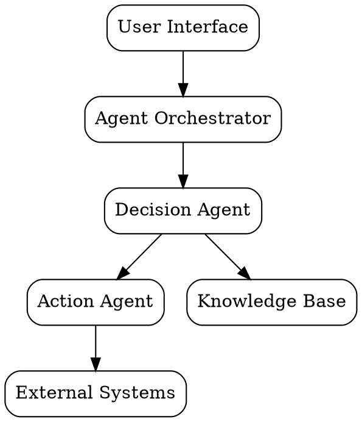

# High-Level Design - Agentic AI Solution - Demo13

**Version:** 1.0

---

### 1.1 Document Purpose

**Purpose:** This consultant-level High-Level Design (HLD) document serves as a bridge between business requirements and technical implementation. It provides a business-focused solution design with a conceptual technical approach, intended for handoff to the technical architect.

**Intended Audience:** This document is designed for executives, business stakeholders, and technical architects. It ensures that all parties have a clear understanding of the proposed solution, its commercial viability, governance framework, and the conceptual technical approach.

**Document Scope:** The scope of this HLD includes:
- **Business Solution:** Detailed description of the problem statement, objectives, and the business-oriented solution approach.
- **Commercial Viability:** Clear cost breakdown, return on investment (ROI) justification, delivery timeline, and resource requirements.
- **Governance:** Compliance requirements, risk assessment with mitigation strategies, and high-level security principles.
- **Conceptual Technical Approach:** Major AI agents, their interactions, agent capabilities, decision-making processes, and technology choices at a strategic level.

**Handoff to Agent 3 for Detailed Technical Design:** This HLD provides the strategic direction and constraints for the agentic AI solution. The detailed technical design, including agent tools, actions, and knowledge integration, will be created by Agent 3 using Amazon Bedrock AgentCore and Strands.

---

### 1.2 Revision History

| Version | Date       | Author  | Changes                  |
|---------|------------|---------|--------------------------|
| 1.0     | 2024-07-01 | TBD     | Initial draft            |
| 1.1     | 2024-07-05 | TBD     | Added section on governance |
| 1.2     | 2024-07-10 | TBD     | Updated technical approach |

---

### 1.3 Stakeholders

| Stakeholder        | Role                  | Responsibility                                                                                      |
|--------------------|-----------------------|------------------------------------------------------------------------------------------------------|
| Sarah Chen         | Executive Sponsor     | Strong commitment to AI transformation, concerned about maintaining vendor relationships during transition, allocated $850K budget with expectation of 24-month payback, quarterly steering committee oversight. |
| Jane Smith         | AP Manager            | Key stakeholder in the Accounts Payable (AP) department, cautious about AI implementation.            |
| TBD                | Business Lead         | Responsible for aligning the AI solution with business objectives and ensuring successful implementation. |
| TBD                | Technical Lead        | Responsible for overseeing the technical aspects of the AI solution and ensuring its successful deployment. |

---

### 2.0 Executive Summary

#### Transformation Vision and Strategic Approach
The transformation vision for the Citadel is to revolutionize the Accounts Payable (AP) process by leveraging autonomous AI agents to handle business processes. This strategic approach aims to reduce exception resolution time, improve supplier relationships, and capture tribal knowledge, ultimately leading to a more efficient and innovative AP function.

#### Recommended Solution Approach (Business View)
The recommended solution approach involves deploying autonomous AI agents to handle the majority of AP exceptions. These agents will be capable of making decisions, taking actions, and continuously learning from their interactions. The solution will be integrated with existing systems such as SAP S/4HANA, Microsoft Exchange Server 2019, and Office 365, ensuring seamless data flow and real-time event-driven integration.

#### Expected Business Outcomes and Success Metrics
The expected business outcomes include:
- Reducing exception resolution time from 3-4 days to 4-8 hours.
- Resolving 70% of exceptions autonomously.
- Improving supplier response rate from 60% to 85%.
- Capturing and codifying tribal knowledge.
- Reducing AP team workload by 40%.

Success metrics will be measured by the reduction in exception resolution time, the percentage of exceptions resolved autonomously, the improvement in supplier response rate, the amount of tribal knowledge captured, and the reduction in AP team workload.

#### Investment Summary and ROI
The total investment for the project is $850,000 AUD over 18 months. The expected return on investment (ROI) is 185% over 3 years, with a payback period of 24 months. The quantifiable benefits include labor cost savings ($1,440K), faster exception resolution ($150K), improved supplier relationships ($240K), and reduced error correction costs ($450K). The qualitative benefits include improved supplier relationships, reduced AP team workload, and captured tribal knowledge.

#### Timeline and Delivery Approach
The project timeline is 18 months, with a sense of urgency to deploy the solution and start realizing benefits. The delivery approach will involve AWS Professional Services for initial implementation and an AI consultant for 6 months post-launch. The project team composition includes a Project Manager, Business Analyst, Solution Architect, Integration Developers, QA/Test Lead, Change Manager, and an AP Subject Matter Expert.

#### Critical Success Factors and Key Risks
Critical success factors include strong executive sponsorship, effective change management, and continuous monitoring and optimization of the AI agents. Key risks include incorrect agent decisions, data privacy and security breaches, and supplier relationship damage. Mitigation strategies will involve complete traceability, audit trails, and regular reviews by the AI Ethics Committee.

---

### 3.1 Problem Statement

#### Current State Description and Pain Points
The current state of the Accounts Payable (AP) process involves handling 50,000 invoices monthly, with 30% requiring manual exception handling due to discrepancies between invoices and Goods Receipt Notes (GRNs). These discrepancies include quantity mismatches, price variances, missing GRNs, and partial deliveries. The manual exception handling process results in a variable resolution time, ranging from 1 hour to 5+ days per exception. This process is further complicated by over 200 supplier-specific rules, most of which are undocumented, and five distinct approval workflows. The AP team, consisting of 15 members, faces a significant workload with 15,000 exceptions per month requiring judgment.

#### Business Impact and Urgency
The manual exception handling process has a profound impact on the business, leading to inefficiencies, delayed payments, and strained supplier relationships. The current annual cost of the problem is $1,830K, which includes AP team salaries ($1,200K), ERP licenses ($80K), infrastructure ($120K), error correction ($300K), late payment penalties ($50K), and missed discounts ($80K). The urgency to address this issue is high, as the cost of doing nothing will continue to incur these high operational costs and negatively impact the organization's financial performance.

#### Strategic Alignment with Organizational Goals
The transformation of the AP process aligns with the organization's strategic goals of innovation, efficiency, and cost optimization. By leveraging autonomous AI agents to handle AP exceptions, the organization aims to reduce exception resolution time, improve supplier relationships, and capture tribal knowledge. This transformation will lead to a more efficient and innovative AP function, contributing to the organization's overall success.

#### Market Pressures and Competitive Landscape
The organization operates in a competitive landscape where efficient AP processes are crucial for maintaining a competitive edge. Market pressures include the need to reduce costs, improve supplier relationships, and enhance operational efficiency. By adopting an agentic AI solution, the organization can stay ahead of competitors by leveraging advanced technology to streamline its AP processes.

---

### 3.2 Solution Objectives

#### Primary Objectives (SMART Format)
1. **Specific:** Reduce exception resolution time from 3-4 days to 4-8 hours.
2. **Measurable:** Resolve 70% of exceptions autonomously.
3. **Achievable:** Improve supplier response rate from 60% to 85%.
4. **Relevant:** Capture and codify tribal knowledge within the AP process.
5. **Time-bound:** Reduce AP team workload by 40% within 18 months.

#### Success Criteria and KPIs
- **Exception Resolution Time:** Achieve an average resolution time of 4-8 hours for 70% of exceptions.
- **Autonomous Resolution Rate:** Maintain a 70% autonomous resolution rate for exceptions.
- **Supplier Response Rate:** Increase the supplier response rate to 85%.
- **Tribal Knowledge Capture:** Document and codify at least 50% of tribal knowledge within the first 12 months.
- **AP Team Workload Reduction:** Reduce AP team workload by 40% within 18 months.

#### Expected Benefits (Quantitative and Qualitative)
- **Quantitative Benefits:**
  - Labor cost savings of $1,440K.
  - Faster exception resolution, saving $150K.
  - Improved supplier relationships, contributing $240K in benefits.
  - Reduced error correction costs, saving $450K.
- **Qualitative Benefits:**
  - Improved supplier relationships.
  - Reduced AP team workload.
  - Captured tribal knowledge, enhancing process efficiency.

#### Alignment with Business Strategy
The solution objectives align with the organization's strategic goals of innovation, efficiency, and cost optimization. By leveraging autonomous AI agents to handle AP exceptions, the organization aims to reduce exception resolution time, improve supplier relationships, and capture tribal knowledge. This transformation will lead to a more efficient and innovative AP function, contributing to the organization's overall success.

---

### 3.3 Proposed Solution Approach

#### Agentic AI Solution Overview (Business Perspective)
The proposed solution involves deploying autonomous AI agents to handle the majority of Accounts Payable (AP) exceptions. These agents will be capable of making decisions, taking actions, and continuously learning from their interactions. The solution will be integrated with existing systems such as SAP S/4HANA, Microsoft Exchange Server 2019, and Office 365, ensuring seamless data flow and real-time event-driven integration.

#### Agent Capabilities: What Decisions Agents Make Autonomously
The AI agents will be designed to autonomously handle the following tasks:
- **Exception Detection:** Identify discrepancies between invoices and Goods Receipt Notes (GRNs) such as quantity mismatches, price variances, missing GRNs, and partial deliveries.
- **Decision Making:** Make decisions on how to resolve exceptions, such as contacting suppliers for clarification, adjusting invoice amounts, or escalating complex cases to human agents.
- **Action Execution:** Execute actions based on their decisions, such as sending emails to suppliers, updating invoice records, or triggering approval workflows.
- **Learning and Adaptation:** Continuously learn from their interactions and adapt their decision-making processes to improve accuracy and efficiency over time.

#### How Agents Address Each Pain Point with Autonomous Behavior
- **Manual Exception Handling:** Agents will autonomously handle 70% of exceptions, reducing the need for manual intervention and speeding up resolution times.
- **Undocumented Supplier-Specific Rules:** Agents will use fuzzy matching and judgment to reconcile discrepancies between supplier names and invoice data, ensuring accurate processing.
- **Multiple Approval Workflows:** Agents will navigate and execute the appropriate approval workflows based on the exception type and supplier rules.
- **Variable Resolution Time:** Agents will aim to resolve exceptions within 4-8 hours, significantly reducing the current 3-4 day resolution time.

#### User Experience with AI Agents (Human-Agent Collaboration)
The user experience with AI agents will involve a collaborative approach where human agents and AI agents work together to resolve exceptions. Human agents will oversee the AI agents, provide guidance, and intervene when necessary. The AI agents will provide recommendations and actions, allowing human agents to focus on complex cases and strategic tasks.

#### Process Changes Enabled by Autonomous Agents
The deployment of autonomous agents will enable several process changes:
- **Reduced Manual Intervention:** With 70% of exceptions handled autonomously, the AP team can focus on strategic tasks and complex cases.
- **Improved Efficiency:** Faster exception resolution times will lead to improved operational efficiency and reduced costs.
- **Enhanced Supplier Relationships:** Timely and accurate exception handling will improve supplier relationships and response rates.
- **Captured Tribal Knowledge:** The AI agents will capture and codify tribal knowledge, enhancing process efficiency and reducing reliance on individual expertise.

---

### 3.4 Functional and Non-Functional Requirements

#### Core Functional Requirements
1. **Exception Detection:** Automatically identify discrepancies between invoices and Goods Receipt Notes (GRNs) such as quantity mismatches, price variances, missing GRNs, and partial deliveries.
2. **Decision Making:** Autonomously make decisions on how to resolve exceptions, such as contacting suppliers for clarification, adjusting invoice amounts, or escalating complex cases to human agents.
3. **Action Execution:** Execute actions based on decisions, such as sending emails to suppliers, updating invoice records, or triggering approval workflows.
4. **Learning and Adaptation:** Continuously learn from interactions and adapt decision-making processes to improve accuracy and efficiency over time.
5. **User Roles and Permissions:** Define roles and permissions for users interacting with the AI agents, ensuring appropriate access and oversight.
6. **Key Use Cases and Scenarios:** Identify and document key use cases and scenarios where AI agents will be utilized, such as handling standard exceptions, escalating complex cases, and capturing tribal knowledge.
7. **Business Rules and Logic:** Incorporate and enforce business rules and logic within the AI agents, ensuring compliance with organizational policies and standards.
8. **Integration Touchpoints (Business View):** Identify and document integration touchpoints with existing systems such as SAP S/4HANA, Microsoft Exchange Server 2019, and Office 365, ensuring seamless data flow and real-time event-driven integration.

#### Performance Requirements
- **Response Times:** Aim for a response time of 4-8 hours for 70% of exceptions.
- **Throughput:** Handle 15,000 exceptions per month with a peak of 1,500 exceptions per day at month-end.
- **Concurrency:** Support concurrent processing of multiple exceptions to ensure efficient utilization of resources.

#### Scalability Requirements
- **Expected Growth:** Accommodate a 20% annual growth in invoice volume.
- **Peak Loads:** Handle peak loads of up to 1,500 exceptions per day.
- **User Volumes:** Support a growing number of users interacting with the AI agents as the solution scales.

#### Availability Requirements
- **SLAs:** Maintain a service level agreement (SLA) with a target uptime of 99.9%.
- **Uptime Targets:** Ensure the solution is available 24/7 with minimal downtime.
- **RTO/RPO:** Define recovery time objectives (RTO) and recovery point objectives (RPO) to ensure quick recovery in case of disruptions.

#### Operational Requirements
- **Monitoring:** Implement robust monitoring and logging to track agent performance, exceptions, and system health.
- **Support:** Provide ongoing support and maintenance for the AI agents, including regular updates and patches.
- **Maintenance Windows:** Schedule regular maintenance windows to perform updates and optimizations without impacting system availability.

#### Constraints and Limitations
- **Data Privacy and Security:** Ensure compliance with data privacy and security regulations, including the Privacy Act 1988 and PCI-DSS.
- **Regulatory and Compliance:** Adhere to regulatory requirements such as the Australian Taxation Office (ATO) and Corporations Act 2001.
- **Risk Tolerance:** Maintain a high risk tolerance for process automation of standard cases, medium for AI decision-making with oversight, and low for autonomous financial decisions.
- **Third-Party and Vendor:** Ensure compliance with third-party and vendor requirements, including ISO 27001 and SOC 2 Type II certifications.

---

### 3.5 Change Management Strategy

#### Stakeholder Engagement Approach
The stakeholder engagement approach will involve regular communication and collaboration with key stakeholders throughout the transformation process. This will include:
- **Executive Sponsor:** CFO Sarah Chen will provide strong commitment and oversight, ensuring alignment with organizational goals and maintaining vendor relationships during the transition.
- **AP Manager:** Jane Smith will be a key stakeholder, providing insights and feedback on the AP process and ensuring smooth integration with the AI agents.
- **AP Team:** The 15-person AP team will be engaged through regular updates, training sessions, and feedback mechanisms to ensure their buy-in and support for the transformation.

#### Training and Enablement Plan
The training and enablement plan will be designed to equip the AP team with the necessary skills and knowledge to effectively collaborate with the AI agents. This will include:
- **Initial Training:** Comprehensive training sessions on the capabilities and functionalities of the AI agents, focusing on how to interact with them and leverage their autonomous behavior.
- **Ongoing Enablement:** Regular refresher courses and workshops to keep the team updated on new features and best practices for working with the AI agents.
- **Support Resources:** Access to documentation, FAQs, and a dedicated support team to address any questions or issues that arise during the transition.

#### Communication Strategy
The communication strategy will ensure that all stakeholders are informed and engaged throughout the transformation process. This will include:
- **Regular Updates:** Monthly newsletters and updates to keep stakeholders informed about the progress, benefits, and any changes to the AP process.
- **Town Hall Meetings:** Quarterly town hall meetings to provide an opportunity for stakeholders to ask questions, share feedback, and discuss any concerns.
- **Feedback Mechanisms:** Establishing channels for stakeholders to provide feedback and suggestions, ensuring their voices are heard and considered in the transformation process.

#### Adoption Metrics and Monitoring
Adoption metrics and monitoring will be used to track the progress and success of the transformation. This will include:
- **Usage Metrics:** Monitoring the usage of the AI agents, including the number of exceptions handled autonomously and the reduction in manual intervention.
- **Performance Metrics:** Tracking key performance indicators (KPIs) such as exception resolution time, supplier response rate, and AP team workload reduction.
- **Feedback Surveys:** Regular surveys to gather feedback from stakeholders on their experience with the AI agents and the transformation process.

#### Resistance Mitigation
Resistance mitigation strategies will be implemented to address any resistance or concerns that may arise during the transformation. This will include:
- **Change Champions:** Identifying and empowering change champions within the AP team to advocate for the transformation and address any resistance.
- **Addressing Concerns:** Proactively addressing any concerns or misconceptions about the AI agents, providing clear explanations and demonstrations of their capabilities and benefits.
- **Support and Guidance:** Offering ongoing support and guidance to stakeholders, ensuring they feel confident and comfortable with the new AP process.

---

### 4.1 Investment Summary

#### Total Budget and Cost Breakdown
The total budget allocated for the Citadel project is $850,000 AUD over 18 months. The budget has been approved by the CFO, Finance Committee, and the Board. The cost breakdown is as follows:
- **AWS Infrastructure:** $180,000
- **Professional Services:** $320,000
- **Integration Development:** $150,000
- **Change Management:** $80,000
- **Contingency:** $20,000

#### Capital vs Operational Expenses
The investment is primarily operational expenses, with a small portion allocated for capital expenses related to AWS infrastructure. The majority of the budget is dedicated to professional services, integration development, and change management.

#### Resource Requirements (People, Tools, Services)
The project team composition includes:
- **Project Manager:** 1 FTE
- **Business Analyst:** 1 FTE
- **Solution Architect:** 0.5 FTE
- **Integration Developers:** 2 FTE
- **QA/Test Lead:** 1 FTE
- **Change Manager:** 0.5 FTE
- **AP Subject Matter Expert:** 0.3 FTE

Additionally, the project will utilize 3 FTE of external resources for professional services and integration development.

#### Ongoing Operational Costs
The expected ongoing annual costs in Year 2 and beyond are $1,123K, which includes:
- **AP Team Salaries:** $720K
- **ERP Licenses:** $48K
- **AWS Infrastructure:** $120K
- **Agent Maintenance:** $25K
- **Support and Training:** $20K
- **Reduced Error Correction Costs:** $180K

The costs are expected to decrease further as the solution matures and realizes its full benefits.

---

### 4.2 Business Case and ROI

#### Cost-Benefit Analysis
The cost-benefit analysis for the Citadel project demonstrates a strong financial justification. The current annual cost of the problem is $1,830K, which includes AP team salaries ($1,200K), ERP licenses ($80K), infrastructure ($120K), error correction ($300K), late payment penalties ($50K), and missed discounts ($80K). The cost of doing nothing is continuing to incur these high operational costs.

#### ROI Calculation and Payback Period
The expected return on investment (ROI) is 185% over 3 years, with a payback period of 24 months. The quantifiable benefits include:
- **Labor Cost Savings:** $1,440K
- **Faster Exception Resolution:** $150K
- **Improved Supplier Relationships:** $240K
- **Reduced Error Correction Costs:** $450K

#### Net Present Value (NPV) if Applicable
The net present value (NPV) of the project is calculated based on the expected cash flows over the 3-year period. The NPV is positive, indicating that the project is financially viable and will generate a positive return on investment.

#### Sensitivity Analysis and Assumptions
The sensitivity analysis shows that the project is robust to changes in key assumptions, such as the reduction in AP team salaries, the cost of AWS infrastructure, and the rate of error correction. The project remains financially viable even under conservative assumptions.

#### Non-Financial Benefits
In addition to the financial benefits, the project will deliver several non-financial benefits, including:
- **Improved Supplier Relationships:** Faster and more accurate exception resolution will lead to improved supplier relationships and higher response rates.
- **Captured Tribal Knowledge:** The AI agents will capture and codify tribal knowledge, enhancing process efficiency and reducing reliance on individual expertise.
- **Reduced AP Team Workload:** The autonomous handling of exceptions will reduce the AP team workload by 40%, allowing them to focus on strategic tasks and complex cases.

---

### 4.3 Delivery Approach and Timeline

#### Delivery Methodology
The delivery methodology for the Citadel project will be a hybrid approach, combining elements of agile and waterfall methodologies. This approach will allow for flexibility and iterative development while ensuring that key milestones and deliverables are met.

#### Phase Breakdown and Milestones
The project will be divided into the following phases, each with specific milestones:
1. **Planning and Design Phase:**
   - Define project scope and objectives.
   - Develop detailed design documents.
   - Finalize project plan and timeline.
2. **Implementation Phase:**
   - Set up AWS infrastructure.
   - Develop and integrate AI agents with existing systems.
   - Conduct initial testing and validation.
3. **Testing and Validation Phase:**
   - Perform comprehensive testing of AI agents.
   - Validate agent performance against success criteria.
   - Gather feedback from stakeholders and make necessary adjustments.
4. **Deployment Phase:**
   - Deploy AI agents to production environment.
   - Monitor performance and address any issues.
   - Provide ongoing support and maintenance.

#### Timeline with Key Dates
The project timeline is 18 months, with the following key dates:
- **Month 1-3:** Planning and Design Phase
- **Month 4-9:** Implementation Phase
- **Month 10-12:** Testing and Validation Phase
- **Month 13-15:** Deployment Phase
- **Month 16-18:** Ongoing Support and Optimization

#### Dependencies and Critical Path
The critical path for the project includes the following dependencies:
- **AWS Infrastructure Setup:** Must be completed before AI agent development can begin.
- **AI Agent Development:** Dependent on the availability of integration developers and solution architects.
- **Testing and Validation:** Dependent on the completion of AI agent development and integration.
- **Deployment:** Dependent on the successful completion of testing and validation.

#### Go-Live Strategy
The go-live strategy will involve a phased rollout of the AI agents, starting with a pilot group of users and gradually expanding to the entire AP team. This approach will allow for monitoring and adjustment of the agents' performance in a controlled environment before full deployment.

---

### 5.1 Compliance and Regulatory Requirements

#### Applicable Regulations and Standards
The Citadel project must comply with the following regulations and standards:
- **Australian Taxation Office (ATO):** Ensure compliance with tax-related regulations and reporting requirements.
- **Corporations Act 2001:** Adhere to corporate governance and financial reporting standards.
- **Privacy Act 1988:** Protect personal and sensitive information in accordance with privacy laws.
- **Payment Card Industry Data Security Standard (PCI-DSS):** Maintain secure handling of payment card data.

#### Compliance Requirements and Controls
The project will implement the following compliance requirements and controls:
- **Data Governance and Privacy:** Establish data ownership, data classification (confidential, internal, PII, public), access controls, and data residency requirements.
- **Risk Tolerance and Boundaries:** Define the risk appetite for agentic AI, ensuring high process automation of standard cases, medium AI decision-making with oversight, low autonomous financial decisions, medium supplier relationship management, and very low data privacy and security risks.
- **Third-Party and Vendor:** Ensure compliance with third-party and vendor requirements, including ISO 27001 and SOC 2 Type II certifications.

#### Audit and Reporting Obligations
The project will adhere to the following audit and reporting obligations:
- **Audit Trail and Explainability:** Maintain a complete audit trail for each exception, including the initial detection, investigation, communication, decision, approval, and outcome. The logs will be stored in immutable storage with a 7-year retention period, and suppliers can request explanations of decisions affecting them.
- **Organizational Policies:** Comply with the organization's AI Ethics Policy, which outlines the responsible AI principles of transparency, fairness, accountability, privacy, and safety. The AI Ethics Committee will review compliance with these principles quarterly and escalate violations to the CFO and Board if material.

#### Data Residency and Sovereignty
The project will ensure data residency and sovereignty by:
- **Storing Data within Australia:** All data will be stored within Australia to comply with local data residency requirements.
- **Data Residency Requirements:** Adhere to data residency requirements for sensitive information, ensuring that data is not transferred outside of Australia without proper authorization.

#### Industry-Specific Requirements
The project will address the following industry-specific requirements:
- **Financial Industry:** Ensure compliance with financial industry regulations and standards, including the Corporations Act 2001 and PCI-DSS.
- **Supplier Relationship Management:** Maintain secure and compliant handling of supplier data and communications.

---

### 5.2 Risk Assessment and Mitigation

#### Risk Register with Likelihood and Impact
The risk register for the Citadel project includes the following key risks, assessed by their likelihood and impact:
1. **Incorrect Agent Decisions:**
   - **Likelihood:** Medium
   - **Impact:** High
   - **Mitigation:** Implement complete traceability and audit trails for each exception, ensuring that any agent decision can be explained and reviewed.
2. **Data Privacy and Security Breaches:**
   - **Likelihood:** Low
   - **Impact:** Very High
   - **Mitigation:** Adhere to ISO 27001 and SOC 2 Type II certifications, conduct regular penetration testing and vulnerability scanning, and provide security awareness training.
3. **Supplier Relationship Damage:**
   - **Likelihood:** Medium
   - **Impact:** High
   - **Mitigation:** Ensure timely and accurate exception handling, maintain open communication with suppliers, and escalate complex cases to human agents.
4. **Change Fatigue and Resistance:**
   - **Likelihood:** Medium
   - **Impact:** Medium
   - **Mitigation:** Implement a robust change management strategy, including stakeholder engagement, training, and support.

#### Technical Risks and Mitigation
- **Integration Complexity:** The integration of AI agents with existing systems such as SAP S/4HANA and Microsoft Exchange Server 2019 may pose technical challenges.
  - **Mitigation:** Conduct thorough testing and validation of integrations, and utilize external expertise for complex integration tasks.
- **Performance and Scale:** Ensuring the AI agents can handle the expected volume of exceptions and scale with the growing invoice volume.
  - **Mitigation:** Design the solution with performance and scalability in mind, and conduct load testing to ensure it can handle peak loads.

#### Business Risks and Mitigation
- **Change Readiness:** The AP team may have mixed attitudes toward AI, leading to resistance or change fatigue.
  - **Mitigation:** Engage stakeholders early, provide comprehensive training, and establish clear communication channels.
- **Resource Availability:** Limited in-house AI expertise may impact the project's success.
  - **Mitigation:** Utilize external resources for professional services and integration development, and provide ongoing support and training.

#### Security and Compliance Risks
- **Data Residency and Sovereignty:** Ensuring data is stored within Australia and complies with local data residency requirements.
  - **Mitigation:** Store all data within Australia and adhere to data residency requirements for sensitive information.
- **Regulatory Compliance:** Ensuring compliance with regulations such as the Privacy Act 1988 and PCI-DSS.
  - **Mitigation:** Establish data governance and privacy controls, and conduct regular audits to ensure compliance.

#### Contingency Plans
The project will have the following contingency plans in place:
- **Backup and Recovery:** Implement robust backup and recovery procedures to ensure data integrity and availability in case of disruptions.
- **Fallback to Manual Processes:** In case of critical errors or failures, the AP team will have the ability to revert to manual processes temporarily.
- **Incident Response:** Establish an incident response plan to quickly address any security incidents or breaches.

---

### 5.3 Security and Privacy Approach

#### Security Principles and Framework
The security approach for the Citadel project will be guided by the following principles and framework:
- **ISO 27001 Certification:** Ensure the project adheres to the ISO 27001 standard for information security management.
- **SOC 2 Type II Certification:** Maintain compliance with the SOC 2 Type II standard for service organizations, ensuring the security and privacy of customer data.
- **Penetration Testing and Vulnerability Scanning:** Conduct regular penetration testing and vulnerability scanning to identify and address potential security weaknesses.
- **Security Awareness Training:** Provide ongoing security awareness training to all project team members and stakeholders to promote a culture of security.

#### Data Protection and Privacy Approach
The data protection and privacy approach will include:
- **Data Ownership:** Clearly define data ownership and responsibilities for handling sensitive information.
- **Data Classification:** Classify data into categories such as confidential, internal, personally identifiable information (PII), and public, and apply appropriate access controls and protections.
- **Access Controls:** Implement robust access controls to ensure that only authorized users can access sensitive data.
- **Data Residency Requirements:** Ensure that all data is stored within Australia to comply with local data residency requirements.

#### Access Control Strategy
The access control strategy will involve:
- **OAuth 2.0 for Agent Access:** Utilize OAuth 2.0 to securely authenticate and authorize AI agents to access sensitive data.
- **Encryption at Rest and Transit:** Encrypt data both at rest and in transit to protect it from unauthorized access.
- **7-Year Audit Logging:** Maintain a 7-year audit log of all agent actions and decisions to ensure traceability and accountability.

#### Threat Landscape and Protection Approach
The threat landscape for the project includes:
- **Confidential Data in SAP and Exchange:** Sensitive information stored in SAP S/4HANA and Microsoft Exchange Server 2019.
- **Protection Approach:** Implement a multi-layered security approach, including network security, application security, and data security measures.

#### Security Monitoring and Incident Response (High-Level)
The high-level security monitoring and incident response plan will include:
- **Security Monitoring:** Continuously monitor the system for any security incidents or breaches.
- **Incident Response:** Establish an incident response plan to quickly address any security incidents, including containment, eradication, and recovery steps.
- **Regular Audits:** Conduct regular security audits to ensure compliance with security standards and identify any potential vulnerabilities.

---

### 5.4 Governance Framework

#### Governance Structure and Decision Rights
The governance framework for the Citadel project will include the following structure and decision rights:
- **Executive Sponsor:** CFO Sarah Chen will provide strong commitment and oversight, ensuring alignment with organizational goals and maintaining vendor relationships during the transition.
- **Steering Committee:** A quarterly steering committee composed of key stakeholders will review progress, address any issues, and make strategic decisions.
- **Change Approval Board (CAB):** The CAB, composed of IT, AP, Compliance, and Security representatives, will approve all production changes to the IT systems. The change categories include standard changes (no CAB approval), normal changes (CAB approval required), and emergency changes (CIO approval).

#### Operational Oversight and Monitoring
Operational oversight and monitoring will be conducted through:
- **Regular Audits:** Conduct regular audits to ensure compliance with security standards, data governance policies, and regulatory requirements.
- **Performance Monitoring:** Continuously monitor the performance of the AI agents, including exception resolution times, autonomous resolution rates, and supplier response rates.
- **Feedback Mechanisms:** Establish channels for stakeholders to provide feedback and suggestions, ensuring their voices are heard and considered in the governance process.

#### Performance Management and KPIs
Performance management and key performance indicators (KPIs) will be used to track the success of the project. This will include:
- **Exception Resolution Time:** Aim for a response time of 4-8 hours for 70% of exceptions.
- **Autonomous Resolution Rate:** Maintain a 70% autonomous resolution rate for exceptions.
- **Supplier Response Rate:** Increase the supplier response rate to 85%.
- **AP Team Workload Reduction:** Reduce AP team workload by 40% within 18 months.

#### Continuous Improvement Process
The continuous improvement process will involve:
- **Regular Reviews:** Conduct regular reviews of the AI agents' performance and decision-making processes to identify areas for improvement.
- **Feedback Integration:** Integrate feedback from stakeholders and the AP team into the improvement process, ensuring that the solution evolves to meet changing business needs.
- **Updates and Optimizations:** Implement regular updates and optimizations to the AI agents, leveraging new data and insights to enhance their capabilities.

#### Escalation and Issue Resolution
The escalation and issue resolution process will include:
- **Escalation Paths:** Define clear escalation paths for any issues or concerns related to the AI agents, ensuring timely and effective resolution.
- **Issue Resolution:** Establish a dedicated team to address any issues or concerns, providing support and guidance to stakeholders and the AP team.
- **Change Management:** Utilize the change management strategy to address any changes or updates to the AI agents, ensuring smooth integration and minimal disruption.

---

### 6.1 Conceptual Architecture

#### Conceptual Agent Architecture Diagram
The conceptual architecture for the Citadel project involves several AI agents, an orchestrator, and knowledge bases. The diagram below illustrates the major components and their interactions:

#### AI Agents and Their Autonomous Capabilities
The AI agents in the conceptual architecture will have the following autonomous capabilities:
- **Decision Agent:** Autonomously detect exceptions, make decisions on how to resolve them, and escalate complex cases to human agents.
- **Action Agent:** Autonomously execute actions based on decisions made by the Decision Agent, such as sending emails to suppliers, updating invoice records, or triggering approval workflows.

#### Agent Orchestration and Coordination Approach
The Agent Orchestrator will coordinate the activities of the Decision Agent and Action Agent, ensuring seamless integration and communication between them. The orchestrator will:
- **Manage Agent Workflows:** Control the flow of exceptions between the Decision Agent and Action Agent.
- **Monitor Agent Performance:** Track the performance of each agent and provide feedback for continuous improvement.
- **Handle Escalations:** Manage the escalation of complex cases to human agents and ensure timely resolution.

#### Agent-to-System Integration Points
The AI agents will integrate with the following external systems:
- **SAP S/4HANA:** For invoice data and exception handling.
- **Microsoft Exchange Server 2019:** For email communications with suppliers.
- **Office 365:** For document management and collaboration.
- **SharePoint:** For storing and accessing supplier-specific rules and documentation.
- **Procurement System:** For managing supplier relationships and contracts.
- **Document Management:** For storing and retrieving invoice PDFs.

#### Technology Selection Rationale
The technology selection for the Citadel project is based on the following rationale:
- **Amazon Bedrock:** Provides a robust and scalable infrastructure for deploying and managing AI agents, ensuring high performance and reliability.
- **Agentic AI:** Offers the flexibility and adaptability needed to handle complex and dynamic AP exceptions, leveraging autonomous decision-making and continuous learning.

---

### 6.2 Technical Approach and Principles

#### Technical Principles and Standards
The technical approach for the Citadel project will be guided by the following principles and standards:
- **ISO 27001 Certification:** Ensure the project adheres to the ISO 27001 standard for information security management.
- **SOC 2 Type II Certification:** Maintain compliance with the SOC 2 Type II standard for service organizations, ensuring the security and privacy of customer data.
- **Penetration Testing and Vulnerability Scanning:** Conduct regular penetration testing and vulnerability scanning to identify and address potential security weaknesses.
- **Security Awareness Training:** Provide ongoing security awareness training to all project team members and stakeholders to promote a culture of security.

#### Cloud Strategy and Service Selection Approach
The cloud strategy for the project will involve:
- **AWS Infrastructure:** Utilize Amazon Web Services (AWS) for the deployment and management of AI agents, ensuring scalability, performance, and security.
- **Service Selection:** Select AWS services that align with the project's requirements, such as Amazon Bedrock for AI agent deployment, Amazon S3 for data storage, and Amazon SageMaker for machine learning capabilities.

#### Scalability and Performance Approach
The scalability and performance approach will include:
- **Auto Scaling:** Implement auto-scaling capabilities to handle the expected growth in invoice volume and peak loads.
- **Performance Optimization:** Continuously monitor and optimize the performance of AI agents, ensuring they meet the required response times and throughput.

#### Resilience and Availability Strategy
The resilience and availability strategy will involve:
- **High Availability:** Design the solution with high availability in mind, ensuring minimal downtime and quick recovery in case of disruptions.
- **Disaster Recovery:** Establish a disaster recovery plan to ensure data integrity and system availability in case of catastrophic events.

#### Integration Patterns and Standards
The integration patterns and standards will include:
- **Real-Time Event-Driven Integration:** Utilize real-time event-driven integration to ensure timely and accurate communication between AI agents and external systems.
- **API-First Approach:** Adopt an API-first approach for integrating AI agents with existing systems, ensuring seamless data flow and interoperability.

#### Handoff to Agent 3 for Detailed Technical Design
The conceptual technical approach and principles outlined in this section will serve as the foundation for the detailed technical design. Agent 3 will be responsible for creating the detailed technical design, including agent tools, actions, and knowledge integration, based on these principles and the conceptual architecture.

---

